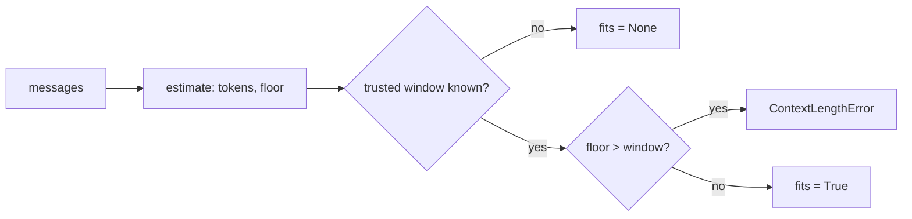

# Token Estimation and Context Budgets

How many input tokens will this request spend, and does it fit the model it is going to?
Every app that assembles large prompts ends up hand-rolling this arithmetic per provider.
AnyInfer answers it once, against the same provenance-tagged capability data that drives
routing and cost.

The result is not isolated bookkeeping: it feeds the
[context reducer](context-reduction.md), the pre-dispatch gate, cost planning, and the
router's context-overflow chain, so changing the target changes all four from the same
capability record.

<div class="anyinfer-hero-diagram" markdown>

</div>

## The Calculator

`budget()` computes a preflight budget without sending anything; no request is issued, no
network is touched:

```python
budget = client.budget(messages, target="openai:gpt-4.1")

budget.input_allowance_tokens  # window − output reserve − safety headroom
budget.estimate.tokens  # estimated input spend, by component
budget.remaining_tokens  # how much more material still fits
budget.fits  # True / False / None
```

The allowance is the context window minus two deductions:

- **Output reserve**: room for the response. Derived, not flat: a request that sets
  `max_output_tokens` reserves exactly that; otherwise the 4,096-token default applies,
  capped by the model's known maximum output.
- **Safety headroom**: 5% of the window, clamped to [256, 8192], held back against
  estimation error.

An app packing context reads `remaining_tokens` and keeps adding material while it stays
positive. That is the whole loop.

## Unknown Stays Unknown

The verdict is tri-state, exactly like [cost](cost.md#cost-is-tri-state). When no
trustworthy context window is known, `fits` and the allowances are `None`, never a
guessed default window presented as a bound:

```python
budget.fits  # None; unknown, distinguishable from both True and False
```

## Estimates Are Two Numbers

No tokenizer ships in the core. The default estimator is a byte heuristic, and it is
explicit about being an estimate by carrying two figures with opposite biases:

| Figure | Bias | Used for |
|---|---|---|
| `tokens` | High (`ceil(bytes/3)`) | Planning; deciding how much more fits. |
| `floor` | Low (`bytes//8`) | The pre-dispatch gate; refusing a request. |

The two consumers need opposite errors: when packing, overestimating keeps the
application safe; when refusing, only an underestimate justifies the refusal.

Anything more accurate plugs in through the `TokenEstimator` protocol; tiktoken, a
provider's count-tokens endpoint, llama-server's `/tokenize`. An exact tokenizer returns
`floor == tokens`, which gives the gate full force:

```python
class TiktokenEstimator:
    def estimate(self, text: str) -> ai.TokenEstimate:
        count = len(encoding.encode(text))
        return ai.TokenEstimate(count, count)


client = ai.Client(providers, estimator=TiktokenEstimator())
```

## When the Provider Bills for More Than You Sent

Some providers wrap your messages in a harness of their own (an agent preamble,
built-in tool declarations, workspace framing), then bill and window-check the inflated
total. Estimating such a provider from message bytes alone under-counts every request,
so the provider declares its own correction and the budget reports it as a separate
component:

```python
budget = client.budget(messages, target="copilot:auto")

budget.estimate.messages.tokens  # what you sent
budget.estimate.envelope.tokens  # what the provider wraps around it
```

[GitHub Copilot](../providers/copilot.md) is the case in the shipped registry. The
correction moves the planning figure only, never the floor: a lower bound may only claim
tokens the provider certainly charges, so a calibrated provider packs more
conservatively without ever refusing a request it might have served.

## Estimated Cost

When trustworthy pricing exists for the target (see
[where prices come from](cost.md#where-prices-come-from)), the budget also carries a
preflight cost range:

```python
budget.estimated_cost  # CostEstimate(low=..., high=..., currency="USD") or None
```

- `low` prices the estimate's floor with zero output: the least the request can cost.
- `high` prices the planning estimate plus the full output reserve: a ceiling under the
  budget's own assumptions.

It is a range on purpose: the input estimate is two-sided and the output spend is unknown
until the model stops, so one number would be false precision. And it is tri-state like
everything else; no trusted pricing means `None`, never `$0.00`.

Estimated money and reported money never mix: `result.usage.cost_usd` is only ever
computed from provider-reported usage, and `estimated_cost` only ever from the estimate.

## The Pre-Dispatch Gate

A request that provably cannot fit its target's context window fails before the round
trip. The gate is conservative in what it claims:

- Only **trusted-provenance** windows gate (`catalog`, `discovered`, `probed`,
  `override`). A `default` window is a placeholder, and a placeholder never blocks a
  request.
- Only the estimate's **floor** gates, compared against the *whole* window: no reserve,
  no headroom. A heuristic overestimate can never refuse a request that might have fit.

A gated target raises `ContextLengthError`, the same class a provider would return, so
the route's overflow chain redirects identically either way, minus the latency:

```python
route = ai.Route(
    targets=("openai:gpt-4.1-mini",),
    context_window_targets=("openai:gpt-4.1",),  # where overflow goes instead
)
```

The gate is on by default and can be disabled per client with
`Client(..., context_gate=False)`.

!!! tip "Key Takeaways"
    - `budget()` never touches the network: it is a preflight calculation against the same
      provenance-tagged capability data that drives routing and cost.
    - The verdict is tri-state: `fits` is `None`, not a guess, when no trusted context
      window exists.
    - Only the estimate's conservative floor, compared against a trusted window, can gate
      a request before dispatch.

## See Also

<div class="anyinfer-see-also" markdown>

- [Capabilities and provenance](capabilities.md): where the context window comes from
  and why its provenance decides whether it may gate.
- [Cost and spending](cost.md): the ceiling the preflight range is checked against.
- [Routing and rate limits](routing.md): `context_window_targets` and the rest of the
  fallback model.
- [Context reduction](context-reduction.md): packing material against
  `remaining_tokens`.

</div>
