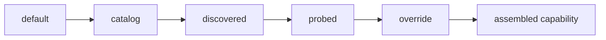

# Capabilities and provenance

Every capability value records **where it came from** — its
[provenance](../reference/glossary.md#provenance). That is the whole idea, and it exists
because providers omit, misreport, and change these numbers — so a consumer needs to know
how much to trust one before routing, budgeting, or billing against it.

<div class="anyinfer-hero-diagram" markdown>

</div>

```python
caps.context_window
# Sourced(value=128000, provenance='discovered')
```

## The five provenances

Weakest to strongest:

| Provenance | Meaning |
|---|---|
| `default` | A descriptor-level fallback. A placeholder, not a fact. |
| `catalog` | From bundled static data we maintain (including the pricing table). |
| `discovered` | Reported by the provider's own model listing. |
| `probed` | Measured by an opt-in probe that spent a real request. |
| `override` | Set deliberately by the integrating application. Outranks everything. |

Assembly layers them in that order, field by field. A weaker value never displaces a
stronger one, and **unknown stays `None`** rather than becoming a guess.

```python
caps = ModelCapabilities(context_window=Sourced(8192, "catalog"))
caps = caps.overlay(ModelCapabilities(context_window=Sourced(32768, "discovered")))
caps.context_window     # Sourced(32768, 'discovered') — discovery wins
```

## What capabilities drive

- **Structured-output mechanism selection** — `features` decides grammar vs json_schema vs
  json_mode vs prompt.
- **Cost computation** — see below.
- **Pre-dispatch gating** — a request that provably cannot fit a known context window fails
  fast instead of paying a round trip. Only trusted-provenance windows gate; see
  [token estimation and context budgets](budgeting.md).

## Cost is tri-state

This is worth stating plainly because it is the most common accounting bug in comparable
tools:

| State | Meaning |
|---|---|
| `Decimal("0.0031")` | A known cost, computed from trustworthy pricing. |
| `None` | **Unknown.** No trustworthy pricing exists. |
| `Decimal("0")` | A genuine zero — free local inference. |

`None` is never coerced to zero. A cost that renders as `$0.00` when it is really unknown
turns a reporting gap into a silent financial error.

Cost is only computed from pricing whose provenance is trusted (`catalog`, `discovered`,
`probed`, or `override`). A `default` price is a placeholder, and computing money from it
would manufacture authority the number does not have.

```python
result.usage.cost_usd    # Decimal or None — check before formatting
```

### Where prices come from

A bundled pricing table supplies the `catalog` layer for hosted models, with each entry
recording when and against what source it was last verified; a weekly repo workflow keeps
it current, and `fetch_pricing()` lets an app pull the maintained file explicitly for
numbers newer than its installed release. Prices are keyed by **provider and model** —
the same model served by a different engine may cost differently, so a price is never
copied across providers. On top of that:

- **OpenRouter** reports real per-token pricing in its model listing, so its costs carry
  `discovered` provenance and beat the table.
- **Local engines** (Ollama, llama.cpp) get a genuine `Pricing(0, 0)` — free inference is
  a real zero, not an unknown.
- **Azure AI Foundry and the Copilots** ship no table entries on purpose: Foundry pricing
  is region- and deployment-specific, and Copilot bills by subscription rather than per
  token. Their costs stay honestly `None` unless you override.

### Overriding prices (and anything else)

`capability_overrides` applies your own numbers at `override` provenance — the strongest
layer, so a deliberate correction can never lose to data the library merely collected:

```python
client = ai.Client(
    providers,
    capability_overrides={
        "azure-foundry:my-gpt5-deployment": ai.ModelCapabilities(
            pricing=ai.Sourced(ai.Pricing(Decimal("1.10"), Decimal("9"))),
            context_window=ai.Sourced(400_000),
        ),
    },
)
```

Provenance on the supplied fields is stamped automatically — supplying them deliberately
*is* the provenance.

## The `auto` sentinel

Some providers pick the model at request time (GitHub Copilot's `"auto"`). The only honest
capability claim is then the **conjunction** across every model it might choose: the minimum
of each numeric bound, the intersection of feature flags.

```python
caps = conjunction([gpt_5_caps, gpt_41_caps])
caps.context_window      # the smaller of the two
caps.features            # only features both support
```

If *any* candidate's bound is unknown, the conjunction is unknown — you cannot promise a
minimum without knowing every value. Claiming more would be a promise the caller cannot
verify until a request fails.

## Three states, not two

A capability is either **natively supported**, **emulated by the core** (a schema
prompt-injected for a provider with no structured-output mode, say), or **honestly
unavailable** — and the fourth state peers accidentally ship, **silently ignored**, is
what this model exists to prevent.

Some providers accept a parameter, discard it, and return success. `temperature=0` that had
no effect looks exactly like `temperature=0` that worked. AnyInfer declares those on the
descriptor and emits a `ParameterDropped` telemetry event instead:

```python
class Recorder:
    def on_event(self, event):
        if isinstance(event, ai.ParameterDropped):
            log.warning("%s ignored %s: %s", event.target, event.parameter, event.reason)
```

## Inspecting capabilities

```python
for model in client.models("openrouter"):
    caps = model.capabilities
    if caps and caps.context_window:
        print(model.id, caps.context_window.value, f"({caps.context_window.provenance})")
```

!!! tip "Key takeaways"
    - Every capability value carries provenance — `default`, `catalog`, `discovered`,
      `probed`, or `override` — so callers know how much to trust it.
    - Cost is tri-state: a real amount, a genuine zero for local inference, or `None` for
      unknown. `None` is never coerced to zero.
    - Assembly is a strict overlay: a weaker value never displaces a stronger one, and
      unknown fields stay unknown rather than becoming guesses.

## See also

<div class="anyinfer-see-also" markdown>

- [Structured output](structured-output.md) — the mechanism ladder in detail.
- [Token estimation and context budgets](budgeting.md) — what the context window drives.
- [Telemetry](telemetry.md) — `ParameterDropped` and `UsageEstimated` events.

</div>
