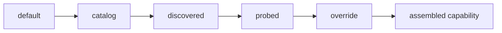

# Capabilities and provenance

Every capability value records where it came from — its
[provenance](../reference/glossary.md#provenance). Providers omit, misreport, and change
these numbers, so before routing, budgeting, or billing against one, a consumer needs to
know how much to trust it.

<div class="anyinfer-hero-diagram" markdown>

</div>

```python
caps.context_window
# Sourced(value=128000, provenance='discovered')
```

## The five provenances

Weakest to strongest:

| Provenance | Meaning |
|---|---|
| `default` | A descriptor-level fallback. A placeholder, not a fact. |
| `catalog` | From bundled static data the project maintains, including the pricing table. |
| `discovered` | Reported by the provider's own model listing. |
| `probed` | Measured by an [opt-in probe](#proving-a-target-works) that spent a real request. |
| `override` | Set by the integrating application. Outranks everything. |

Assembly layers them in that order, field by field. A weaker value never displaces a
stronger one, and unknown stays `None` rather than becoming a guess:

```python
caps = ModelCapabilities(context_window=Sourced(8192, "catalog"))
caps = caps.overlay(ModelCapabilities(context_window=Sourced(32768, "discovered")))
caps.context_window  # Sourced(32768, 'discovered'); discovery wins
```

Some providers report rich model listings. OpenRouter includes per-model pricing,
[Nebius](../providers/nebius.md) reports context and quantization, and
[xAI](../providers/xai.md) reports feature support; those values arrive at `discovered`
provenance and beat the catalog. Where a listing is unavailable, assembly degrades to the
weaker layers rather than failing.

## What capabilities drive

- **Structured-output mechanism selection.** The feature flags decide grammar vs
  `json_schema` vs JSON mode vs prompt — see
  [structured output](structured-output.md).
- **Cost computation.** Only trusted-provenance pricing produces money — see
  [cost and spending](cost.md).
- **Pre-dispatch gating.** A request that provably cannot fit a known context window
  fails fast instead of paying a round trip. Only trusted-provenance windows gate — see
  [context budgets](budgeting.md).
- **Probe sizing.** A target known to reason gets a larger budget for the `verify()`
  probe, since a thinking model spends the ordinary one before it says anything.

`default_temperature` and `default_top_p` record what "provider default" concretely means
for a model, populated only from the provider's own documentation via its contract
snapshot. Almost every provider answers `None`, and that is the finished state, not a gap:
inventing a plausible number would defeat the point of tagging where numbers come from.

## Overriding capabilities

`capability_overrides` applies your own numbers at `override` provenance, the strongest
layer, so a deliberate correction never loses to data the library merely collected:

```python
client = ai.Client(
    providers,
    capability_overrides={
        "azure-foundry:my-gpt5-deployment": ai.ModelCapabilities(
            pricing=ai.Sourced(ai.Pricing(Decimal("1.10"), Decimal("9"))),
            context_window=ai.Sourced(400_000),
        ),
    },
)
```

Provenance on the supplied fields is stamped automatically; supplying them is the
provenance.

## The `auto` sentinel

Some providers pick the model at request time (GitHub Copilot's `"auto"`). The only safe
capability claim is then the conjunction across every model the provider might choose:
the minimum of each numeric bound, the intersection of feature flags.

```python
caps = conjunction([gpt_5_caps, gpt_41_caps])
caps.context_window  # the smaller of the two
caps.features  # only features both support
```

If any candidate's bound is unknown, the conjunction is unknown — you cannot promise a
minimum without knowing every value.

## Three states, not two

A capability is natively supported, emulated by the core (a schema prompt-injected for a
provider with no structured-output mode, say), or explicitly unavailable. The fourth
state — a parameter accepted, discarded, and reported as success — is the one AnyInfer
refuses to have: `temperature=0` that had no effect looks exactly like `temperature=0`
that worked. Known drops are declared on the descriptor and reported as
[`ParameterDropped` telemetry](telemetry.md) instead of sent.

The same rule applies per model. A descriptor knows how a provider spells reasoning
effort; it does not know which of that provider's models have one. A request carrying
`reasoning="high"` to a model whose capabilities lack `Feature.REASONING` withholds the
field and reports it.

Both only happen on a *known* absence. A `default`-provenance feature set is a guess, and
the library does not drop a caller's parameter on a guess — the same rule as the
[pre-dispatch gate](budgeting.md#the-pre-dispatch-gate).

## Proving a target works

Three mechanisms answer "will this target actually serve my request?", from cheapest to
most thorough.

**`resolve()` proves the spelling.** It maps a target string or alias to a concrete
provider and model, or raises with a hint — see
[targets and aliases](targets.md#resolution-is-total). No network traffic.

**`verify()` proves one round trip.** Resolution says nothing about whether the
credential can generate, the model id exists at that endpoint, or the deployment has
capacity — and a health probe does not either, since everything a health probe touches
can be fine while inference still fails. `verify()` spends one tiny request and reports
rather than raises:

```python
result = client.verify("openai:gpt-5")

result.ok  # answered, in the shape asked for, with the expected content
result.reached  # answered at all
result.detail  # what went wrong, when something did
result.target  # which model actually served it — meaningful for "auto"
```

The two booleans are separate because the fixes are different:

| `reached` | `ok` | What it means |
|---|---|---|
| `False` | `False` | Nothing answered. Wrong endpoint, bad credential, no capacity. |
| `True` | `False` | The connection is fine; the model could not hold the requested shape. |
| `True` | `True` | Good. |

The CLI wraps the same call as
[`anyinfer verify`](../guides/cli.md#checking-a-target-actually-works).

**`probe()` measures features.** On the compatibility surface, every preset endpoint and
self-hosted server starts from an educated guess, and a server that accepts
`response_format` while ignoring it is indistinguishable from one that honors it — until
a schema stops being enforced. `probe()` settles it by trying, one tiny request per
feature:

```python
report = client.probe("openai-compat:m")  # four requests by default

report.summary
# 'openai-compat:m: supports JSON_MODE, STREAMING; does not support JSON_SCHEMA'
```

Findings record at `probed` provenance, so the next request stops guessing. Pass
`record=False` to look without committing. Outcomes are three-state: `supported`,
`unsupported`, and `inconclusive` — the provider accepted the request and answered
something else. Inconclusive results are not recorded, because one reply cannot separate
a weak model from an ignored parameter.

!!! warning "Probing costs requests"
    Four round trips for the default feature set, billed like any other. Run it once when
    an application first configures an endpoint, not on every start.

## Runtime diagnostics

A capability says what a model *can* do, not what state the engine is in right now. The
worst local-inference surprise lives in that gap: the request succeeded, the answer is
correct, and it took ninety seconds because the model no longer fits in VRAM and half of
it ran on the CPU. No health probe catches that — the server is perfectly reachable.

Providers that can inspect their own runtime report it:

```python
for note in client.diagnostics("ollama"):
    print(note.code, note.message)
# ollama.gpu-spill  qwen3:8b is only 45% resident in VRAM; the rest runs on the CPU ...
```

The same notes arrive on every result that hit the condition, and as
[`ProviderDiagnostic` telemetry](telemetry.md):

```python
result = client.generate(prompt, target="ollama:qwen3:8b")
result.warnings  # ("qwen3:8b is only 45% resident in VRAM; ...",)
```

Which providers can answer is declared on the descriptor (`reports_diagnostics`). Today
that is [Ollama](../providers/ollama.md) (VRAM spill) and
[llama.cpp](../providers/llama-cpp.md) (a GPU machine serving on the CPU). Diagnostics
are advisory: they never fail a request and never gate routing.

## Inspecting capabilities

```python
for model in client.models("openrouter"):
    caps = model.capabilities
    if caps and caps.context_window:
        print(model.id, caps.context_window.value, f"({caps.context_window.provenance})")
```

!!! tip "Key takeaways"
    - Every capability value carries provenance — `default`, `catalog`, `discovered`,
      `probed`, or `override` — and assembly never lets a weaker source displace a
      stronger one.
    - Unknown stays `None`. Nothing is upgraded from "assumed" to "known" without a
      listing, a probe, or your override.
    - `resolve()` checks spelling for free, `verify()` spends one request to prove a
      round trip, and `probe()` spends about four to measure features on compatibility
      endpoints.
    - Parameters are only withheld on a known absence, and every withholding is reported
      as `ParameterDropped`.

## See also

<div class="anyinfer-see-also" markdown>

- [Cost and spending](cost.md): tri-state cost and where prices come from.
- [Structured output](structured-output.md): the mechanism ladder the feature flags
  drive.
- [Token estimation and context budgets](budgeting.md): what the context window gates.
- [Telemetry](telemetry.md): `ParameterDropped` and `ProviderDiagnostic` events.

</div>
