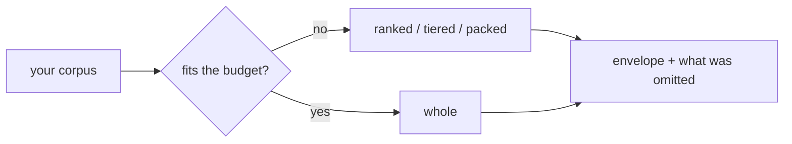

# Context reduction

You have more material than the model's window holds. `anyinfer.context` decides what to
actually send — and tells you exactly what it dropped.

Together with [`client.budget()`](budgeting.md), this turns context preparation into part
of the inference contract: the selected target supplies the limit, the reducer stays within
it, and the result carries a machine-readable account of lost fidelity.

<div class="anyinfer-hero-diagram" markdown>

</div>

## The boundary: you collect, the library reduces

**Your application collects.** Walking the filesystem, applying ignore rules, excluding
secrets, asking the user what to share — all of that stays yours, permanently. It is
where the security policy lives, and it is where every application differs.

**The library reduces.** Ranking, selecting, and representing what you hand it. This
subpackage never opens a file, never touches the network, and adds no dependencies.

```python
import anyinfer as ai
from anyinfer import context

# You collected and approved these.
docs = [context.ContextDocument.of(path, text) for path, text in my_approved_files]

budget = client.budget(messages, target="anthropic:claude-sonnet-4-5")
reduction = context.select(
    docs,
    query="how does credential resolution work?",
    max_tokens=budget.remaining_tokens or 8_000,
)

messages.insert(0, ai.user(reduction.text))
print(reduction.summary())
# ranked: 12 of 340 document(s); ~7900 of 8000 tokens; 328 omitted; limited by tokens
```

## "Can't I just send it as several messages?"

No — and this is the first thing everyone asks. Every message in a request shares one
context window. Splitting the same material across ten messages sends exactly as many
tokens as sending it in one.

What actually works is either **less fidelity in one request** (`ranked`, `tiered`,
`packed`) or **more requests** (`distill`). This subpackage does both.

## The five strategies

| Strategy | Sends | Use when |
|---|---|---|
| `whole` | Everything | The corpus fits. Nothing to decide. |
| `ranked` | The most relevant whole documents | You want full files, and partial ones would confuse |
| `tiered` | Every document, at decreasing fidelity | The model should know the whole corpus exists |
| `packed` | The most relevant *chunks* | The answer is one function in a large file |
| `distill` | A summary written by the model | The corpus will never fit at any fidelity |

`auto` — the default — sends everything when it fits, and falls back to `tiered`.

### `tiered`, the interesting one

`ranked` answers "which files fit?" `tiered` answers "how do I say *something* about every
file?" Three tiers, each cheaper per document:

1. **Module rollup** — one entry per directory: file count, corpus share, languages,
   dependencies, symbols. Every document is covered here, always.
2. **Structural extracts** — signatures and imports for the highest-ranked documents.
3. **Verbatim** — whole files for whatever budget remains.

The rollup gets a reserved share of the budget so it cannot be crowded out. A model that
knows `src/auth/` exists can ask about it; one that never saw it cannot.

### `packed`, for sub-document granularity

Documents are split at paragraph boundaries (falling back to line breaks, then a hard cut),
every chunk is ranked, and the best ones are packed. Adjacent chunks are coalesced when
rendered, so a contiguous run appears as one block with one line span rather than as
fragments implying gaps that are not there.

Pinned documents are never chunked: pinning means "the user chose this file", and sending
a piece of it answers a question they did not ask.

### `distill`, which spends money

The only strategy that issues generation calls, so it is a separate function rather than a
`select()` strategy:

```python
result = await context.distill(
    corpus, "what changed in the release?",
    client=client, target="anthropic:claude-sonnet-4-5",
)
print(result.text)
print(result.calls, "calls")   # the multiplier, made visible
print(result.usage.cost_usd)   # what it actually cost
```

It maps each chunk to notes, then reduces the notes to an answer. When the notes together
exceed the window, the reduce goes **hierarchical** — batches sized by what actually fits,
then batches of those — rather than sending one overflowing request. A deterministic
`reducer=` replaces the reduce call entirely, so an application that merges structurally
pays only for the map phase.

## Ranking is lexical, and that is a real limit

The ranker is BM25-style: term frequency, saturated and length-normalized, weighted by
inverse document frequency, plus two signals that matter in a code corpus — a query term
in the **path** outweighs the same term in the body, and anchor files (`README`,
`pyproject.toml`, `ARCHITECTURE`) get a small bonus.

**There are no embeddings.** A query for "authentication" will not find a file that only
says "login". That is a deliberate boundary, not an oversight: embeddings would mean a
model dependency, an index to build and invalidate, and a whole class of failure the slim
core avoids. If you need semantic retrieval, rank yourself and pass the result as pinned
documents — `context.rank()` is public precisely so it can be replaced.

## Budgets: unknown stays unknown

`select()` takes an explicit `max_tokens`. The intended source is a preflight
[budget](budgeting.md):

```python
budget = client.budget(messages_without_context, target=target)
budget.remaining_tokens   # the number to pack against — or None
```

When the window is unknown, `remaining_tokens` is `None`, and the library will not invent
one. You choose the fallback, in the open, where the choice is visible. This is the same
rule that governs [capabilities](capabilities.md) and cost.

Byte and document ceilings apply independently of tokens, because transports cap bytes:
`max_bytes` defaults to 4 MiB and `max_documents` to 200.

## Every reduction announces itself

Reduction *emulates* a larger context window. Emulation that hides itself is the failure
mode this subsystem exists to prevent — a truncated corpus and a complete one produce
answers that look identical.

```python
reduction.omitted_count        # 328
reduction.binding_constraints  # ("tokens",)
reduction.complete             # False
reduction.summary()            # content-free, safe to log or show a user
reduction.metadata()           # the full machine-readable record
```

Pass an `observer=` to receive a `ContextReduced` [telemetry event](telemetry.md). It
carries counts and ceilings only — never paths or content, because a path name can itself
be sensitive.

## Stable ordering, so prompt caches hit

Selected documents render in **path order** by default, regardless of how they ranked. Two
consecutive turns that select the same documents produce byte-identical text, so provider
prompt caches and llama-server slot reuse keep working. Pass `render_order="rank"` for
strongest-first instead, if you would rather have relevance ordering than cache stability.

Ranking itself is fully deterministic: identical inputs produce identical output whatever
order you supplied the documents in.

## The envelope format

Reduced output is a mechanical data envelope, not a template. Neutral tags, HTML-escaped
attributes, no prose:

```xml
<context>
  <file path="src/auth/credentials.py" sha256="a1b2…">…content…</file>
  <file-chunk path="src/big.py" sha256="c3d4…" lines="120-186">…span…</file-chunk>
</context>

<context-tiers coverage_files="340">
  <module path="src/auth" files="12" corpus_share="0.180" languages="python">
  dependencies: os, pathlib
  symbols: CredentialResolver, resolve, EnvResolver
  </module>
</context-tiers>
<file-extract path="src/auth/env.py" sha256="e5f6…">…signatures…</file-extract>
```

You place `reduction.text` in your own message. The library never touches
`GenerationRequest.messages` — all the prompt language around the envelope stays yours.

The format is stable enough to parse back out of stored transcripts, so changing it is a
documented breaking change.

## See also

<div class="anyinfer-see-also" markdown>

- [Fitting a corpus to a budget](../guides/fitting-context.md) — the task-oriented walkthrough.
- [Token estimation and context budgets](budgeting.md) — where `max_tokens` comes from.
- [Telemetry](telemetry.md) — observing reductions.

</div>
