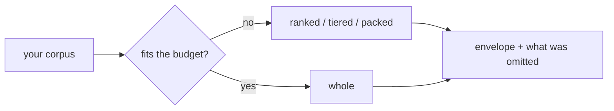

# Context reduction

You have more material than the model's window holds. `anyinfer.context` decides what to
actually send — and tells you exactly what it dropped.

Together with [`client.budget()`](budgeting.md), this turns context preparation into part
of the inference contract: the selected target supplies the limit, the reducer stays within
it, and the result carries a machine-readable account of lost fidelity.

<div class="anyinfer-hero-diagram" markdown>

</div>

## The boundary: you collect, the library reduces

**Your application collects.** Walking the filesystem, applying ignore rules, excluding
secrets, asking the user what to share — all of that stays yours, permanently. It is
where the security policy lives, and it is where every application differs.

**The library reduces.** Ranking, selecting, and representing what you hand it. This
subpackage never opens a file, never touches the network, and adds no dependencies.

```python
import anyinfer as ai
from anyinfer import context

# You collected and approved these.
docs = [context.ContextDocument.of(path, text) for path, text in my_approved_files]

budget = client.budget(messages, target="anthropic:claude-sonnet-4-5")
reduction = context.select(
    docs,
    query="how does credential resolution work?",
    max_tokens=budget.remaining_tokens or 8_000,
)

messages.insert(0, ai.user(reduction.text))
print(reduction.summary())
# ranked: 12 of 340 document(s); ~7900 of 8000 tokens; 328 omitted; limited by tokens
```

## "Can't I just send it as several messages?"

No — and this is the first thing everyone asks. Every message in a request shares one
context window. Splitting the same material across ten messages sends exactly as many
tokens as sending it in one.

What actually works is either **less fidelity in one request** (`ranked`, `tiered`,
`packed`) or **more requests** (`distill`). This subpackage does both.

## The five strategies

| Strategy | Sends | Use when |
|---|---|---|
| `whole` | Everything | The corpus fits. Nothing to decide. |
| `ranked` | The most relevant whole documents | You want full files, and partial ones would confuse |
| `tiered` | Every document, at decreasing fidelity | The model should know the whole corpus exists |
| `packed` | The most relevant *chunks* | The answer is one function in a large file |
| `distill` | A summary written by the model | The corpus will never fit at any fidelity |

`auto` — the default — sends everything when it fits, and falls back to `tiered`.

Not sure which? [`context.plan()`](#plan-before-you-commit) costs all four and tells you.

### `tiered`, the interesting one

`ranked` answers "which files fit?" `tiered` answers "how do I say *something* about every
file?" Three tiers, each cheaper per document:

1. **Module rollup** — one entry per directory: file count, corpus share, languages,
   dependencies, symbols. Every document is covered here, always.
2. **Structural extracts** — signatures and imports for the highest-ranked documents.
3. **Verbatim** — whole files for whatever budget remains.

The rollup gets a reserved share of the budget so it cannot be crowded out. A model that
knows `src/auth/` exists can ask about it; one that never saw it cannot.

### `packed`, for sub-document granularity

Documents are split at paragraph boundaries (falling back to line breaks, then a hard cut),
every chunk is ranked, and the best ones are packed. Adjacent chunks are coalesced when
rendered, so a contiguous run appears as one block with one line span rather than as
fragments implying gaps that are not there.

Pinned documents are never chunked: pinning means "the user chose this file", and sending
a piece of it answers a question they did not ask.

### `distill`, which spends money

The only strategy that issues generation calls, so it is a separate function rather than a
`select()` strategy:

```python
result = await context.distill(
    corpus, "what changed in the release?",
    client=client, target="anthropic:claude-sonnet-4-5",
)
print(result.text)
print(result.calls, "calls")   # the multiplier, made visible
print(result.usage.cost_usd)   # what it actually cost
```

It maps each chunk to notes, then reduces the notes to an answer. When the notes together
exceed the window, the reduce goes **hierarchical** — batches sized by what actually fits,
then batches of those — rather than sending one overflowing request. A deterministic
`reducer=` replaces the reduce call entirely, so an application that merges structurally
pays only for the map phase.

## Duplicates are collapsed, not ranked against each other

Real corpora repeat themselves: vendored copies, generated siblings, a file forked and
lightly edited. Ranking those independently spends a whole budget on eight renderings of
one thing.

**Byte-identical documents collapse by default.** One copy is rendered; the rest become
pointers. Nothing is lost, so this is on without asking:

```xml
<file path="src/auth/token.py" sha256="a1b2…">…content…</file>
<duplicate path="vendor/token.py" of="src/auth/token.py" identical="true"/>
```

**Near-identical documents collapse on request.** Set `near_duplicate_threshold` and
documents above that Jaccard similarity group too. This one is lossy — the near-duplicate's
*differences* are not sent — so it is off by default, it renders `identical="false"`, and it
makes `reduction.complete` false. Pinned documents are never collapsed this way: pinning
means you chose the file, and its differences are the reason.

Similarity is estimated with MinHash over banded signatures, so a corpus of thousands costs
a linear pass rather than a quadratic one, and the grouping is identical on every run.

## A file that doesn't fit can be shortened instead of dropped

Between a structural extract and a whole file there is a wide gap, and a document that just
misses the budget falls all the way through it. `compact_fallback` fills it: the file is
retried with comments, docstrings, license headers, and blank runs removed. On real source
that is a 25-40% saving at very little semantic cost.

```xml
<file-compact path="src/auth/env.py" sha256="e5f6…" elided_lines="34">…code…</file-compact>
```

Only lines that are *entirely* a comment are removed. Stripping a trailing `//` would mean
knowing whether it sits inside a string literal, which needs a parser this subpackage does
not have — and getting that wrong corrupts code rather than shortening it.

## Plan before you commit

`plan()` runs every deterministic strategy, measures what each would render, and throws the
text away. It spends no inference and touches no network, so the numbers are exact rather
than modelled:

```python
outcome = context.plan(docs, query, max_tokens=8_000)
print(outcome.summary())
# 340 document(s) against 8000 tokens; best tiered (46 kept, 0 omitted, ~7900 tokens);
# distill would spend 141+ call(s)

for option in outcome.options:
    print(option.strategy, option.selected_count, option.estimated_tokens, option.complete)
```

`outcome.best()` is a recommendation — most of the corpus at the highest fidelity — not a
decision. An app that would rather have twelve whole files than four hundred summarized
ones should read `options` and pick for itself.

## Turn two: send the same thing

Path-ordered rendering makes a *given* selection stable. Handing back the previous
reduction's state keeps the selection itself stable, so the prompt prefix doesn't churn
when the corpus barely moved:

```python
first = context.select(docs, query, max_tokens=8_000, tuning=tuning)
...
second = context.select(docs, query, max_tokens=8_000, tuning=tuning, previous=first.state())
print(second.carried_over)   # documents kept because the last turn had them
```

Unchanged documents get `carry_over_bonus` added to their score. A document whose content
changed is deliberately excluded — carrying it over would move the prefix anyway.

## Ranking is lexical, and that is a real limit

The ranker is BM25-style: term frequency, saturated and length-normalized, weighted by
inverse document frequency, plus two signals that matter in a code corpus — a query term
in the **path** outweighs the same term in the body, and anchor files (`README`,
`pyproject.toml`, `ARCHITECTURE`) get a small bonus.

**There are no embeddings.** That is a deliberate boundary, not an oversight: embeddings
would mean a model dependency, an index to build and invalidate, and a whole class of
failure the slim core avoids. If you need semantic retrieval, rank yourself and pass the
result as pinned documents — `context.rank()` is public precisely so it can be replaced.

Three settings close part of the gap without an index or a model:

- **`split_identifiers`** tokenizes `resolveCredentials` as the compound *and* as `resolve`
  and `credentials`, so a query written in words matches an identifier written in code.
- **`query_expansion`** ranks once, harvests the terms that make the top documents
  distinctive, and ranks again. This is what actually finds "login" from
  "authentication" — whenever some document in the corpus uses both. It costs a second
  ranking pass and no inference. It also inherits the classic failure: if the top documents
  are wrong, expansion makes them wronger, which is why expansion terms weigh less than
  yours.
- **`salience_weight`** scores a document by its centrality in the corpus's own import
  graph. That signal is query-*independent*, which makes it the answer to a question the
  other two cannot address: how to order a corpus when the query is weak or absent. Without
  it, an empty query scores everything zero and falls through to the path tie-break.

## Advanced settings, in one place

Every algorithmic choice above is a field on `ContextTuning` rather than a constant. Pass it
to `select()`, put it in the `context` block of your [configuration file](../reference/configuration.md),
or set it with a `--context-*` flag on [`anyinfer context`](../guides/cli.md). The three
name the same things because the CLI generates its flags from the dataclass.

```python
tuning = context.ContextTuning.recommended()
reduction = context.select(docs, query, max_tokens=8_000, tuning=tuning)
```

**Defaults reproduce the behaviour AnyInfer has always had.** A reduction that silently
changes shape between releases is exactly what this subsystem exists to prevent, so every
setting that changes what gets sent is off until you turn it on. The single exception is
exact-duplicate collapse, which is lossless and announces itself.

`recommended()` is the set worth having for a source-code corpus: near-duplicate collapse
at a strict threshold, density ordering with a mild diversity penalty, identifier splitting
and query expansion, a light centrality signal, compact fallback instead of dropping, and a
carry-over bonus.

| Setting | Default | What it changes |
|---|---|---|
| `collapse_duplicates` | `True` | Render byte-identical documents once |
| `near_duplicate_threshold` | `0.0` | Collapse merely *similar* documents too |
| `selection_order` | `"rank"` | `"density"` admits by score **per token** |
| `diversity` | `0.0` | Penalize candidates resembling what is already chosen |
| `split_identifiers` | `False` | Tokenize compound identifiers into their parts |
| `query_expansion` | `False` | Pseudo-relevance feedback before ranking |
| `salience_weight` | `0.0` | Blend in import-graph centrality |
| `compact_fallback` | `False` | Shorten a document rather than drop it |
| `carry_over_bonus` | `0.0` | Keep the previous turn's selection, with `previous=` |
| `chunk_tokens` | `512` | Chunk size for `packed` and `distill` |
| `rollup_share` | `0.45` | Budget share `tiered` reserves for its rollup |

### Why `density` usually wins

`rank` admits documents strongest-first. `density` admits them by score *divided by what
they cost*. It is the classic knapsack result: relevance per token packs measurably more
relevance into a fixed budget than relevance alone. The tradeoff is that it will sometimes
prefer two good small files to one great large one, which is the wrong call when the great
large one is the answer.

### Why `diversity` matters more than it sounds

Pure relevance will happily spend an entire budget on eight files that say the same thing.
`diversity` penalizes each candidate by how much it resembles what is already selected, so
the ninth slot goes to something new. The penalty is multiplicative — `value * (1 -
diversity * similarity)` — because the two value scales differ by orders of magnitude.

## Conversations are context too

`select()` reduces material you *collected*. `compact_history()` reduces material you
*produced* — and in an agentic loop that is where the window actually goes.

```python
compaction = context.compact_history(messages, max_tokens=budget.remaining_tokens or 8_000)
result = await client.generate(list(compaction.messages), target=target)
print(compaction.summary())
# history: 14 of 42 message(s); ~7600 of 8000 tokens; 12 dropped; 9 payload(s) elided
```

Three passes over the middle, cheapest loss first: tool-result payloads are elided, then
text payloads, then plain messages are dropped. Each stops the moment the conversation fits.

What it will not do is the part naive truncation gets wrong:

- **System messages are never touched.** They are instructions, not history.
- **The recent window is never touched.** It is what the model is answering.
- **Tool-call pairing is never broken.** A message carrying a `ToolCall` or `ToolResult` is
  emptied, never dropped — a provider rejects a call with no result and a result with no
  call, so dropping one of a pair trades an oversized request for a rejected one.
- **Elision is visible.** An emptied payload becomes `[elided 4821 characters]`, not silence.

If the protected messages alone exceed the budget, you get `fits=False` and the conversation
back unchanged. Giving up a system prompt or the current turn is your decision, not the
library's.

This is a pure function — messages in, messages out. Call it yourself and place the result,
or hand the client a policy and let it apply the same rules on the request path.

### Or let the client do it

A prompt that outgrows its window has two possible answers: send it somewhere with a bigger
window, or make it smaller. The router has always owned the first — that is what
[`Route.context_window_targets`](routing.md) is. `HistoryPolicy` is the second, at the same
layer:

```python
client = ai.Client(providers, history=ai.HistoryPolicy())
```

Because it lives on the client, every frontend built on one behaves identically: the Python
API, `anyinfer run`, the tool loop, and the [OpenAI-compatible sidecar](../serve/README.md).
None of them implement it; they inherit it.

| Mode | When it compacts |
|---|---|
| `last_resort` (default) | Only after every target — including the overflow chain — is exhausted |
| `proactive` | Before dispatch, to fit the resolved target |

`last_resort` prefers a larger-window model to losing history, and costs one refused
preflight before it acts. `proactive` avoids that preflight, but a larger-window target
further down the route is never reached, because there is no longer an overflow to redirect.

Two things it will not do. It is **off unless you configure it** — no policy means the
behaviour you have today, which is to reroute or fail. And it never compacts against an
**unknown** window: the client will not invent one to justify discarding your conversation.

Every compaction emits a `ContextReduced` event with `strategy="history"`, so a shortened
conversation is never a silent one.

## Budgets: unknown stays unknown

`select()` takes an explicit `max_tokens`. The intended source is a preflight
[budget](budgeting.md):

```python
budget = client.budget(messages_without_context, target=target)
budget.remaining_tokens   # the number to pack against — or None
```

When the window is unknown, `remaining_tokens` is `None`, and the library will not invent
one. You choose the fallback, in the open, where the choice is visible. This is the same
rule that governs [capabilities](capabilities.md) and cost.

Byte and document ceilings apply independently of tokens, because transports cap bytes:
`max_bytes` defaults to 4 MiB and `max_documents` to 200.

## Every reduction announces itself

Reduction *emulates* a larger context window. Emulation that hides itself is the failure
mode this subsystem exists to prevent — a truncated corpus and a complete one produce
answers that look identical.

```python
reduction.omitted_count        # 328 — not represented at all
reduction.collapsed_exact      # 12  — sent once under another path, losslessly
reduction.collapsed_near       # 3   — a similar file was sent; the differences were not
reduction.compacted_count      # 5   — sent without their commentary
reduction.partial_count        # 4   — only some spans of the file were sent
reduction.binding_constraints  # ("tokens",)
reduction.complete             # False
reduction.summary()            # content-free, safe to log or show a user
reduction.metadata()           # the full machine-readable record
```

`complete` means *every offered document reached the model at full fidelity*. Exact
collapse preserves it — the same bytes were sent, once. Near collapse, compaction, and
chunk-level selection each break it, because each drops something that was offered.

Pass an `observer=` to receive a `ContextReduced` [telemetry event](telemetry.md). It
carries counts and ceilings only — never paths or content, because a path name can itself
be sensitive.

## Stable ordering, so prompt caches hit

Selected documents render in **path order** by default, regardless of how they ranked. Two
consecutive turns that select the same documents produce byte-identical text, so provider
prompt caches and llama-server slot reuse keep working. Pass `render_order="rank"` for
strongest-first instead, if you would rather have relevance ordering than cache stability.

Ranking itself is fully deterministic: identical inputs produce identical output whatever
order you supplied the documents in.

## The envelope format

Reduced output is a mechanical data envelope, not a template. Neutral tags, HTML-escaped
attributes, no prose:

```xml
<context format="1">
  <file path="src/auth/credentials.py" sha256="a1b2…">…content…</file>
  <file-chunk path="src/big.py" sha256="c3d4…" lines="120-186">…span…</file-chunk>
  <file-compact path="src/auth/env.py" sha256="e5f6…" elided_lines="34">…code…</file-compact>
  <duplicate path="vendor/credentials.py" of="src/auth/credentials.py" identical="true"/>
</context>

<context-tiers format="1" coverage_files="340">
  <module path="src/auth" files="12" corpus_share="0.180" languages="python">
  dependencies: os, pathlib
  symbols: CredentialResolver, resolve, EnvResolver
  </module>
</context-tiers>
<file-extract path="src/auth/env.py" sha256="e5f6…">…signatures…</file-extract>
```

You place `reduction.text` in your own message. The library never touches
`GenerationRequest.messages` — all the prompt language around the envelope stays yours.

The format is stable enough to parse back out of stored transcripts, so changing it is a
documented breaking change. Both wrappers carry `format` for that reason: version 1 is the
first to declare itself, and an envelope with no `format` attribute predates the
`<duplicate>` and `<file-compact>` elements. The number is bumped when an existing
element's meaning changes, not when one is added — a reader that ignores unknown elements
survives additions, which is the point of declaring the version at all.

## See also

<div class="anyinfer-see-also" markdown>

- [Fitting a corpus to a budget](../guides/fitting-context.md) — the task-oriented walkthrough.
- [Token estimation and context budgets](budgeting.md) — where `max_tokens` comes from.
- [Telemetry](telemetry.md) — observing reductions.

</div>
