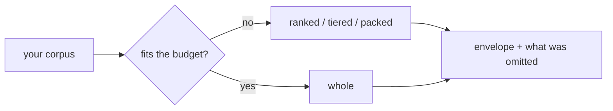

# Context reduction

You have more material than the model's window holds. `anyinfer.context` decides what to
send and tells you exactly what it dropped. Together with
[`client.budget()`](budgeting.md), this makes context preparation part of the inference
contract: the selected target supplies the limit, the reducer stays within it, and the
result carries a machine-readable account of lost fidelity.

<div class="anyinfer-hero-diagram" markdown>

</div>

## You collect, the library reduces

Your application collects: walking the filesystem, applying ignore rules, excluding
secrets, asking the user what to share. That stays yours, because it is where the
security policy lives and where every application differs. The library ranks, selects,
and represents what you hand it — this subpackage never opens a file, never touches the
network, and adds no dependencies.

```python
import anyinfer as ai
from anyinfer import context

# You collected and approved these.
docs = [context.ContextDocument.of(path, text) for path, text in my_approved_files]

budget = client.budget(messages, target="anthropic:claude-sonnet-4-5")
reduction = context.select(
    docs,
    query="how does credential resolution work?",
    max_tokens=budget.remaining_tokens or 8_000,
)

messages.insert(0, ai.user(reduction.text))
print(reduction.summary())
# ranked: 12 of 340 document(s); ~7900 of 8000 tokens; 328 omitted; limited by tokens
```

One question comes up before any of this: can't the material just go in several
messages? No. Every message in a request shares one context window, so splitting the
same material across ten messages sends exactly as many tokens as one. What works is
either less fidelity in one request (`ranked`, `tiered`, `packed`) or more requests
(`distill`).

## The five strategies

| Strategy | Sends | Use when |
|---|---|---|
| `whole` | Everything | The corpus fits. Nothing to decide. |
| `ranked` | The most relevant whole documents | You want full files, and partial ones would confuse |
| `tiered` | Every document, at decreasing fidelity | The model should know the whole corpus exists |
| `packed` | The most relevant *chunks* | The answer is one function in a large file |
| `distill` | A summary written by the model | The corpus will never fit at any fidelity |

`auto`, the default, sends everything when it fits and falls back to `tiered`. Not sure
which? [`plan()`](#plan-before-you-commit) costs all four and tells you.

`tiered` answers "how do I say *something* about every file?" with three tiers, each
cheaper per document: a module rollup (one entry per directory, with a reserved budget
share so it cannot be crowded out), structural extracts for the highest-ranked
documents, and verbatim files for whatever budget remains. A model that knows
`src/auth/` exists can ask about it; one that never saw it cannot.

`packed` splits documents at paragraph boundaries, ranks every chunk, and packs the
best. Adjacent chunks are coalesced when rendered, so a contiguous run appears as one
block. Pinned documents are never chunked — pinning means "the user chose this file",
and sending a piece of it answers a question they did not ask.

`distill` is the only strategy that issues generation calls, so it is a separate
function rather than a `select()` strategy:

```python
result = await context.distill(
    corpus,
    "what changed in the release?",
    client=client,
    target="anthropic:claude-sonnet-4-5",
)
print(result.calls, "calls")  # the multiplier, made visible
print(result.usage.cost_usd)  # what it actually cost
```

It maps each chunk to notes, then reduces the notes to an answer, going hierarchical
when the notes exceed the window. A deterministic `reducer=` replaces the reduce call
entirely. See [the distill example](../examples/distill-a-corpus.md).

## Losing less than you drop

Real corpora repeat themselves. Byte-identical documents collapse by default: one copy
is rendered, the rest become `<duplicate>` pointers, and nothing is lost. Near-identical
documents collapse only on request (`near_duplicate_threshold`), because the
near-duplicate's *differences* are not sent; that makes `reduction.complete` false.
Pinned documents are never collapsed. Similarity uses MinHash over banded signatures, so
thousands of documents cost a linear pass and group identically on every run.

A file that just misses the budget can be shortened instead of dropped:
`compact_fallback` retries it with comments, docstrings, license headers, and blank runs
removed — a 25–40% saving on real source. Only lines that are entirely a comment are
removed, because stripping a trailing `//` correctly would need a parser this subpackage
does not have.

## Plan before you commit

`plan()` runs every deterministic strategy, measures what each would render, and throws
the text away. It spends no inference and touches no network, so the numbers are exact:

```python
outcome = context.plan(docs, query, max_tokens=8_000)
print(outcome.summary())
# 340 document(s) against 8000 tokens; best tiered (46 kept, 0 omitted, ~7900 tokens);
# distill would spend 141+ call(s)
```

`outcome.best()` is a recommendation — most of the corpus at the highest fidelity — not
a decision. An app that would rather have twelve whole files than four hundred
summarized ones should read `options` and pick for itself.

## Turn two: send the same thing

Handing back the previous reduction's state keeps the selection stable, so the prompt
prefix doesn't churn when the corpus barely moved:

```python
second = context.select(docs, query, max_tokens=8_000, tuning=tuning, previous=first.state())
print(second.carried_over)  # documents kept because the last turn had them
```

Unchanged documents get `carry_over_bonus` added to their score; a document whose
content changed is excluded, since carrying it over would move the prefix anyway. This
pairs with stable rendering: selected documents render in path order by default, so two
turns that select the same documents produce byte-identical text and
[provider prompt caches](caching.md) keep hitting. Pass `render_order="rank"` if you
would rather have relevance ordering than cache stability.

## Ranking is lexical

The built-in ranker is BM25-style — term frequency, saturated and length-normalized,
weighted by inverse document frequency — plus two code-corpus signals: a query term in
the path outweighs the same term in the body, and anchor files (`README`,
`pyproject.toml`) get a small bonus. It has no embeddings, which keeps the default path
free of a model dependency and an index to invalidate.

Three `ContextTuning` settings close part of the gap without either:
`split_identifiers` tokenizes `resolveCredentials` as the compound *and* its parts;
`query_expansion` ranks once, harvests the terms that make the top documents
distinctive, and ranks again; `salience_weight` blends in import-graph centrality, which
is query-independent and so still orders a corpus when the query is weak or absent.

For semantic retrieval, `anyinfer.semantic_ranker()` wraps your own
[`embed()`/`rerank()`](embeddings.md) or any embedding index into the same `Ranker`
protocol `select()` expects — see
[the API reference](../reference/api/context.md#ranking).

## Tuning

Every algorithmic choice is a field on `ContextTuning`. Pass it to `select()`, put it in
the `context` block of the [configuration file](../reference/configuration.md), or set
it with a `--context-*` flag on `anyinfer context` — the three name the same things.
Every setting that changes what gets sent is off by default, so a reduction never
changes shape between releases; the single exception is exact-duplicate collapse, which
is lossless. `ContextTuning.recommended()` is the set worth having for a source-code
corpus. The full field table, with the reasoning behind `density` ordering and the
`diversity` penalty, is in
[the API reference](../reference/api/context.md#advanced-settings).

## Conversations are context too

`select()` reduces material you collected. `compact_history()` reduces material you
*produced*, which in an agentic loop is where the window actually goes:

```python
compaction = context.compact_history(messages, max_tokens=budget.remaining_tokens or 8_000)
result = await client.generate(list(compaction.messages), target=target)
# history: 14 of 42 message(s); ~7600 of 8000 tokens; 12 dropped; 9 payload(s) elided
```

Three passes over the middle of the conversation, cheapest loss first: tool-result
payloads are elided, then text payloads, then plain messages are dropped, stopping the
moment it fits. System messages and the recent window are never touched, tool-call
pairing is never broken (a message carrying a `ToolCall` or `ToolResult` is emptied,
never dropped), and every elision is visible as `[elided N characters]`. If the
protected messages alone exceed the budget you get `fits=False` and the conversation
back unchanged.

To apply the same rules automatically on the request path, hand the client a policy:

```python
client = ai.Client(providers, history=ai.HistoryPolicy())
```

`last_resort`, the default mode, compacts only after every target — including
[`Route.context_window_targets`](routing.md) — is exhausted, preferring a larger-window
model to losing history. `proactive` compacts before dispatch instead. The policy is off
unless you configure it, never compacts against an unknown window, and every compaction
emits a `ContextReduced` event, so a shortened conversation is never a silent one.
Because the policy lives on the client, the Python API, the CLI, the tool loop, and the
[sidecar](../serve/README.md) all inherit it identically.

## Every reduction announces itself

Reduction emulates a larger context window, and a truncated corpus produces answers
that look just like a complete one's. So the result records everything:

```python
reduction.omitted_count  # 328; not represented at all
reduction.collapsed_exact  # 12; sent once under another path, losslessly
reduction.collapsed_near  # 3; a similar file was sent; the differences were not
reduction.compacted_count  # 5; sent without their commentary
reduction.partial_count  # 4; only some spans of the file were sent
reduction.complete  # False
reduction.summary()  # content-free, safe to log or show a user
```

`complete` means every offered document reached the model at full fidelity. Pass an
`observer=` to receive a `ContextReduced` [telemetry event](telemetry.md); it carries
counts and ceilings only, never paths or content, because a path name can itself be
sensitive.

Budgets follow the same rule as [capabilities](capabilities.md): when the target's
window is unknown, `budget.remaining_tokens` is `None` and the library will not invent
one — you choose the fallback in the open. Byte and document ceilings apply
independently of tokens (`max_bytes` defaults to 4 MiB, `max_documents` to 200).

## The envelope format

Reduced output is a mechanical data envelope — neutral tags, HTML-escaped attributes, no
prose:

```xml
<context format="1">
  <file path="src/auth/credentials.py" sha256="a1b2…">…content…</file>
  <file-chunk path="src/big.py" sha256="c3d4…" lines="120-186">…span…</file-chunk>
  <file-compact path="src/auth/env.py" sha256="e5f6…" elided_lines="34">…code…</file-compact>
  <duplicate path="vendor/credentials.py" of="src/auth/credentials.py" identical="true"/>
</context>
```

You place `reduction.text` in your own message; the library never touches
`GenerationRequest.messages`. The format is stable enough to parse back out of stored
transcripts, so changing it is a documented breaking change: `format` is bumped when an
existing element's meaning changes, not when one is added. The render functions are in
[the API reference](../reference/api/context.md#rendering).

!!! tip "Key takeaways"
    - Your application collects and approves material; the library only ranks, selects,
      and renders it, with no file or network access of its own.
    - Five strategies cover the fidelity ladder, and `plan()` prices all the
      deterministic ones exactly, for free, before you commit.
    - Every reduction reports what was omitted, collapsed, compacted, or partial;
      `complete` is the one-flag summary.
    - `compact_history()` and `HistoryPolicy` apply the same discipline to
      conversations, without ever breaking tool-call pairing or touching the system
      prompt.
    - Path-ordered rendering keeps consecutive turns byte-identical, which is what keeps
      prompt caches hitting.

## See also

<div class="anyinfer-see-also" markdown>

- [Fitting a corpus to a budget](../guides/fitting-context.md): the task-oriented
  walkthrough.
- [Token estimation and context budgets](budgeting.md): where `max_tokens` comes from.
- [Context reduction API](../reference/api/context.md): every type, tuning field, and
  render function.

</div>
