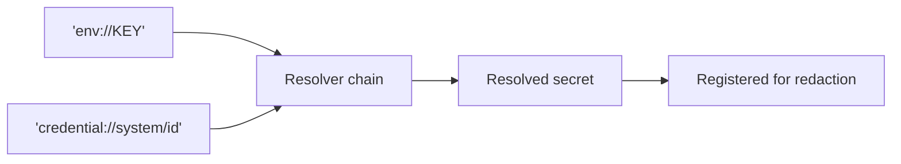

# Credentials and redaction

Two guarantees:

1. A credential can be **referenced** rather than embedded, so config files stay safe to
   commit and share.
2. A resolved secret **can never appear** in a log line, error message, telemetry event, or
   traceback.

<div class="anyinfer-hero-diagram" markdown>

</div>

## References

Three forms ship in v1:

```python
ai.ProviderSettings.of("openai", api_key="sk-literal-value")  # literal
ai.ProviderSettings.of("openai", api_key="env://OPENAI_API_KEY")  # environment
ai.ProviderSettings.of("openai", api_key="credential://system/openai")  # OS keyring
```

The keyring form needs the `[keyring]` extra. A missing extra is a `ConfigError` with an
install hint, not an `ImportError`:

```
ConfigError: the 'credential://' scheme requires the keyring extra
  (hint: pip install 'anyinfer[keyring]')
```

Every failure is actionable in the same way:

```
CredentialError: environment variable OPENAI_API_KEY is not set
  (hint: export OPENAI_API_KEY=<your key> and retry)
```

A typo'd scheme is not silently treated as a literal secret — `LiteralResolver` declines
anything that looks like a known scheme, so `env:/OPENAI_KEY` fails loudly.

## Redaction is automatic and global

Every secret resolved through the credential chain is registered for redaction the moment it
is resolved. From then on, it is stripped from:

- every error's `detail`, `hint`, and `raw_text`;
- every telemetry event field;
- recorded test cassettes, before they touch disk.

```python
raise AuthError(f"invalid key {secret}")
# detail: "invalid key [redacted]"
```

The registry is process-global by design. Secrets are process-global facts, and redaction
has to apply even to errors raised by code that never saw the client that resolved them.

Values shorter than six characters are not registered: redacting them would corrupt
unrelated text far more often than it would protect anything.

You can register additional secrets an application resolves itself:

```python
ai.register_secret(my_token)
```

## Custom resolvers

Applications plug in their own vault:

```python
class VaultResolver:
    def handles(self, reference: str) -> bool:
        return reference.startswith("vault://")

    def resolve(self, reference: str) -> str:
        return my_vault.read(reference[len("vault://") :])


chain = ai.default_resolver()
chain.add(VaultResolver())  # takes precedence over the built-ins

client = ai.Client(providers, resolver=chain)
```

The *chain* registers resolved secrets for redaction, not the individual resolvers, so a
third-party resolver cannot forget to.

## Backend credentials never transit the sidecar

When you run the [sidecar](../serve/README.md), it authenticates *clients to itself*
with its own bearer token. The provider credentials it uses stay on the server. A client
pointed at the frontend never sees, sends, or needs them.

!!! tip "Key takeaways"
    - Credentials are referenced (`env://`, `credential://`), never embedded, so config
      stays safe to commit.
    - Redaction is automatic, global, and applies from the moment a secret resolves —
      including to code that never saw the client that resolved it.
    - Backend credentials never transit the sidecar; it authenticates clients to
      itself with its own bearer token.

## See also

<div class="anyinfer-see-also" markdown>

- [How-to: store credentials in the OS keyring](../guides/credentials.md)
- [Telemetry](telemetry.md): payload privacy, the other half of the security posture.

</div>
