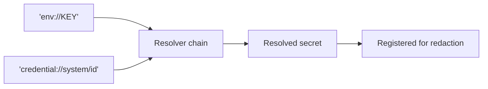

# Credentials and Redaction

Two guarantees:

1. A credential can be **referenced** rather than embedded, so config files stay safe to
   commit and share.
2. A resolved secret **can never appear** in a log line, error message, telemetry event, or
   traceback.

<div class="anyinfer-hero-diagram" markdown>

</div>

## References

Three forms ship in v1:

```python
ai.ProviderSettings.of("openai", api_key="sk-literal-value")  # literal
ai.ProviderSettings.of("openai", api_key="env://OPENAI_API_KEY")  # environment
ai.ProviderSettings.of("openai", api_key="credential://system/openai")  # OS keyring
```

The keyring form needs the `[keyring]` extra. A missing extra is a `ConfigError` with an
install hint, not an `ImportError`:

```
ConfigError: the 'credential://' scheme requires the keyring extra
  (hint: pip install 'anyinfer[keyring]')
```

Every failure is actionable in the same way:

```
CredentialError: environment variable OPENAI_API_KEY is not set
  (hint: export OPENAI_API_KEY=<your key> and retry)
```

A typo'd scheme is not treated as a literal secret: `LiteralResolver` declines anything
that looks like a known scheme, so `env:/OPENAI_KEY` fails loudly.

As a rule of thumb: `env://` is the usual choice for containers and CI, and
`credential://` for a workstation. A literal key is fine in test code and poor in
config.

## Using the OS Keyring

Install the extra, store the secret, and reference it:

```bash
pip install "anyinfer[keyring]"
keyring set AnyInfer openai-api-key
```

```python
client = ai.Client(
    [
        ai.ProviderSettings.of("openai", api_key="credential://system/openai-api-key"),
    ]
)
```

The service name is `AnyInfer`; the identifier is the developer's to choose, and the
reference string is safe to commit: it names where the secret lives, not the secret. Keyring
failures are actionable like the rest:

```
CredentialError: no credential stored under 'openai-api-key'
  (hint: store it with keyring under service 'AnyInfer')

CredentialError: no usable OS credential store is available on this system
  (hint: configure a system keyring, or use 'env://VAR_NAME' instead)
```

Headless Linux often has no usable vault; `env://` is the right answer there, and the
error says so rather than leaving the developer to guess.

## Redaction Is Automatic and Global

Every secret resolved through the credential chain is registered for redaction the moment it
is resolved. From then on, it is stripped from:

- every error's `detail`, `hint`, and `raw_text`;
- every telemetry event field;
- recorded test cassettes, before they touch disk.

```python
raise AuthError(f"invalid key {secret}")
# detail: "invalid key [redacted]"
```

The registry is process-global by design. Secrets are process-global facts, and redaction
has to apply even to errors raised by code that never saw the client that resolved them.

Values shorter than six characters are not registered: redacting them would corrupt
unrelated text far more often than it would protect anything.

An application can register additional secrets it resolves itself:

```python
ai.register_secret(my_token)
```

## Custom Resolvers

For anything beyond the keyring (AWS Secrets Manager, HashiCorp Vault), applications
plug in their own vault:

```python
class VaultResolver:
    def handles(self, reference: str) -> bool:
        return reference.startswith("vault://")

    def resolve(self, reference: str) -> str:
        return my_vault.read(reference[len("vault://") :])


chain = ai.default_resolver()
chain.add(VaultResolver())  # takes precedence over the built-ins

client = ai.Client(providers, resolver=chain)
```

The *chain* registers resolved secrets for redaction, not the individual resolvers, so a
third-party resolver cannot forget to.

## Custom Schemes the Sidecar Can Reach

`chain.add()` needs a constructor call, which an application always has and the
[sidecar](../serve/README.md) never does. `anyinfer serve` can only use what a
configuration file can *name*, so a resolver reaches it through an entry-point group
instead:

```toml
# pyproject.toml of the package providing the scheme
[project.entry-points."anyinfer.credential_stores"]
vault = "my_company.anyinfer_vault:VaultResolver"
```

The entry point resolves to a `CredentialResolver` — the same two-method protocol as
above — or to a class or zero-argument callable returning one. Install the package
alongside AnyInfer and `"api_key": "vault://prod/openai"` works in any config file, from
any frontend, with no code change.

Four rules govern the group, and they are worth knowing before you publish one:

- **Discovered resolvers go first.** They are placed ahead of the built-ins in the
  default chain, which is what lets a custom scheme get first refusal.
- **But they may not claim a built-in scheme.** A resolver whose `handles()` answers
  `True` for `env://` or `credential://` is dropped before it reaches the chain, recorded
  as a `scheme-reserved` issue. Being first in line is for *adding* a scheme, never for
  redefining one — the same collision refusal the `anyinfer.providers` group enforces on
  ids and aliases. A resolver whose `handles()` raises on the probe is dropped too.
- **A failed plugin is skipped, not fatal.** An unreachable vault package must not stop a
  process whose other credentials resolve fine. Each skip warns once and stays readable
  on `chain.plugin_issues()`, and the eventual `CredentialError` names it.
- **An unresolvable scheme fails loudly.** Anything shaped like `scheme://` that no
  resolver handles is refused — at config load where possible, naming the file location.
  It is never accepted as a literal secret, which would put an internal vault path on the
  wire as a bearer token.

!!! warning "This is a trust decision"
    A package published under this group is imported, instantiated, and consulted for
    credential references in your process. That is not a new code-execution primitive —
    any installed distribution can already run code at interpreter startup — but it is a
    designed interposition point on the credential path specifically, reachable through a
    transitive dependency. The built-in schemes are fenced off for exactly that reason.
    Depend on a credential-store plugin the way you would depend on an auth library.

## Backend Credentials Never Transit the Sidecar

When the [sidecar](../serve/README.md) is running, it authenticates *clients to itself*
with its own bearer token. The provider credentials it uses stay on the server. A client
pointed at the frontend never sees, sends, or needs them.

!!! tip "Key Takeaways"
    - Credentials are referenced (`env://`, `credential://`), never embedded, so config
      stays safe to commit.
    - Redaction is automatic, global, and applies from the moment a secret resolves,
      including to code that never saw the client that resolved it.
    - Backend credentials never transit the sidecar; it authenticates clients to
      itself with its own bearer token.
    - A custom scheme reaches the sidecar through the `anyinfer.credential_stores`
      entry-point group; it may add a scheme but never redefine a built-in one.

## See Also

<div class="anyinfer-see-also" markdown>

- [Telemetry](telemetry.md): payload privacy, the other half of the security posture.
- [Shared configuration](../reference/configuration.md): where credential references
  live in the config file.

</div>
