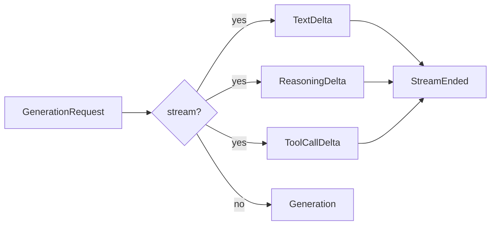

# The event stream

A generation **is** an ordered stream of typed events. Everything else — the non-streaming
`generate()`, the OpenAI chunk format, your progress bar — is a projection of that one
primitive.

This is the design decision the rest of the library rests on, so it is worth understanding.

<div class="anyinfer-hero-diagram" markdown>

</div>

## The events

| Event | Meaning |
|---|---|
| `TextDelta(text)` | A fragment of the visible answer. |
| `ReasoningDelta(text)` | A fragment of thinking, excluded from the answer. |
| `ToolCallDelta(index, call_id, name, arguments_fragment)` | Part of a tool call; correlate by `index`. |
| `UsageUpdate(usage)` | A usage report. May arrive mid-stream, and more than once. |
| `TimingMark(name, at_ms)` | `"attempt_start"` or `"first_token"`, measured by the core. |
| `AttemptFailed(record)` | A target attempt failed; a retry or fallback may follow. |
| `StreamEnded(result)` | Terminal. Carries the assembled `Generation`. |

## The ordering guarantees

These are a **binding contract**, verified by the conformance suite for every adapter:

1. Zero or more `AttemptFailed` may precede any content (failed targets, retries).
2. Within one attempt, `TimingMark("attempt_start")` comes first, and
   `TimingMark("first_token")` appears **exactly once**, immediately before the first
   content delta.
3. `StreamEnded` is always the final event, exactly once. An unrecoverable failure *raises*
   instead of yielding it.
4. Within one attempt, concatenating every `TextDelta.text` equals
   `StreamEnded.result.text`.

Guarantee 4 is what lets you render deltas as they arrive and still trust the final result.

Guarantees 2 and 4 are scoped **per attempt**: when a schema violation triggers the
opt-in repair loop, the repair re-runs the target inside the same stream, announced by a
fresh `TimingMark("attempt_start")`. Treat each `attempt_start` as "clear and start over"
— after it, the delta sequence restarts and `result.text` reflects the final attempt only.

## Three ways to consume it

**Print deltas as they arrive:**

```python
with client.stream(messages, target="ollama:qwen3:8b") as stream:
    for event in stream:
        if isinstance(event, ai.TextDelta):
            print(event.text, end="", flush=True)
```

**Watch for first-token latency, then take the authoritative result:**

```python
async with client.stream(messages, target=target) as stream:
    async for event in stream:
        if isinstance(event, ai.TimingMark) and event.name == "first_token":
            record_ttft(event.at_ms)
    record(stream.result.usage, stream.result.timing)
```

**Ignore events entirely:**

```python
result = client.generate(messages, target=target)
```

`generate()` drains the stream internally. The three shapes are the same machinery.

## Non-streaming providers still stream

An adapter for a provider with no streaming API emits one `TextDelta` and a final event.
Your consumer code does not change, which is the point. The contract is the library's, not
the provider's.

## Usage is a late-arriving, optional event

Usage often arrives *after* the finish reason, in a trailing chunk. Two consequences:

- The parser drains to the protocol's terminal sentinel, never stopping at `finish_reason`.
  Stopping early silently undercounts tokens — a real and widespread bug in comparable
  gateways.
- Providers that report usage only on their terminal object (Ollama) still produce a
  `UsageUpdate` event, because the core synthesizes one. Consumers see one behavior.

## Finish reasons are an open enum

`FinishReason` is `"stop" | "length" | "tool_calls" | "content_filter" | "other"`. A value a
provider invents tomorrow normalizes to `"other"` rather than crashing the reassembler.

## Timing is measured by the core

`first_token_ms`, `total_ms`, and `output_tokens_per_s` are measured centrally against
`time.monotonic()`, so they mean the same thing across every provider and are comparable.
Throughput is measured over the *decode* window (first token → completion), because
including queue and prefill time would understate a model's generation rate.

Provider-reported sub-timings, when available, land in `timing.phases`:

```python
result.timing.phases  # {"model_load_ms": 300.0, "prefill_ms": 200.0, "decode_ms": 1000.0}
```

## Early exit cancels

Leaving a stream's context manager before draining it cancels the underlying request:

```python
with client.stream(prompt, target=target) as stream:
    for event in stream:
        if enough(event):
            break  # the provider request is cancelled here
```

!!! tip "Key takeaways"
    - A generation is one ordered stream of typed events; `generate()` is just the drained
      stream, not a separate code path.
    - Four ordering guarantees are enforced for every adapter by the conformance suite —
      concatenated `TextDelta`s always equal the final text.
    - Usage and timing are measured centrally, so they mean the same thing across providers.

## See also

<div class="anyinfer-see-also" markdown>

- [Routing](routing.md): where `AttemptFailed` comes from.
- [Telemetry](telemetry.md): the separate, observer-facing event channel.
- [OpenAI-compatible sidecar](../serve/README.md): the OpenAI chunk projection.

</div>
