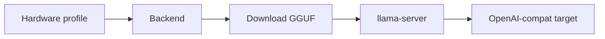

# The local subsystem

Running a model on your own machine should be one target string, with the same guarantees
as a hosted call. This page covers the machinery behind that string: hardware detection,
server tuning, supervision, and measurement.

<div class="anyinfer-hero-diagram" markdown>

</div>

```python
result = client.generate(prompt, target="llama-cpp:qwen2.5-7b-instruct-q4-k-m")
```

Behind that call: resolve the artifact from the [catalog](catalog.md), download and
verify it, detect the hardware, tune a server for it, start it on loopback, speak the
OpenAI dialect, answer. Six components, composed once so applications do not compose
them.

## Hardware detection is advisory

```python
from anyinfer import local

profile = local.detect()
profile.total_ram_bytes  # 136_365_211_648
profile.primary_accelerator  # Accelerator(kind='cuda', total_vram_bytes=..., ...)
profile.warnings  # everything that could not be determined, and why
```

Detection proposes; callers decide. Every probe is best-effort: a missing tool, a
permission error, or unparseable output produces a warning and a `None` field, never an
exception. A wrong number here would mis-tune a server, so unknown is always preferred
to guessed.

Results are disk-cached, keyed by a signature of the probe executables themselves, so
installing a GPU driver invalidates the cache without you knowing you had to. Override
with `ANYINFER_HARDWARE_CACHE_BYPASS` or `ANYINFER_HARDWARE_CACHE_REFRESH`.

## Tuning explains itself

```python
plan = local.plan_server(
    profile,
    local.TuningInputs(artifact_size_bytes=4_680_000_000, parameter_size="7B"),
    posture="balanced",
)

plan.context_size  # 32768
for line in plan.rationale:
    print(line)
# offloading all layers to the cuda device
# 24.0 GiB of VRAM: budgeting 11.2 GiB for the KV cache after 4.4 GiB of weights
# using 4 CPU threads
```

Postures — `conservative`, `balanced`, `aggressive` — control how much of the machine to
commit; aggressive additionally enables a `q8_0` KV cache and two concurrent slots.

Two subtleties the tuner accounts for, both real failure causes when missed. The KV
cache scales with concurrency: llama.cpp spreads `--ctx-size` across `--parallel` slots,
so the real footprint is `context × parallel`, and budgeting one slot then serving two
runs out of VRAM. And weights are resident too — the KV budget is what remains *after*
the model, not the whole device.

Model files themselves are pinned, hash-verified, atomic, and resumable; that machinery
belongs to the catalog — see [what gets verified](catalog.md#what-gets-verified).

## Supervision

The supervised `llama-server` runs as a child process with rules that cover the ways
local multiplexing goes wrong:

- **Swaps are serialized.** Two requests for two unloaded models do not race: the first
  loads, the second waits. Racing means two full model loads competing for the same
  VRAM, and both lose.
- **Requests block until ready.** You never get a 503 because a model happened to be
  loading; the wait is bounded by a health-check timeout.
- **"Loading" and "failed" are distinguished.** The child's output is captured, so a
  broken model reports why, instead of looking like a slow one for the full timeout.
- **The idle timer keys on active streams**, not last-request time, so a long generation
  with no new requests is not killed mid-flight.
- **VRAM admission is checked before spawning.** A model that provably will not fit is
  refused with a clear message rather than crashing the child with an OOM.
- **Reaping is verified.** A process is not gone because it was asked to stop; on
  Windows a launcher can exit while the server it spawned keeps the port and the GPU.

Servers bind `127.0.0.1` only. A non-loopback bind requires
`allow_remote_exposure=True`.

## What is already usable here

Before running anything, there is a cheaper question: what can this machine use right
now?

```python
from anyinfer import default_registry, local

found = await local.discover(default_registry)
# (DiscoveredProvider(provider_id='ollama', evidence='endpoint', detail='4 models', …),
#  DiscoveredProvider(provider_id='anthropic', evidence='environment',
#                     credential_ref='env://ANTHROPIC_API_KEY', …))
```

Discovery contacts only loopback addresses that a provider descriptor declares as its
defaults, reports an endpoint only when it answers with at least one model, and never
reads a secret — environment evidence records the variable's name as `env://NAME` and
the value stays where it was. The OS keyring is a third source, off by default because
reading a vault can prompt the user to unlock it. `anyinfer init` is this composed with
the config writer — see [the CLI guide](../guides/cli.md).

## Tier recommendation

```python
recommendation = local.recommend_alias(profile, ai.load_default_catalog())
recommendation.alias  # "large"
recommendation.reason  # "24 GiB of VRAM comfortably fits the large tier"
recommendation.confident  # False when memory could not be determined
```

Requirements live in the catalog as data, so updating a recommendation is a catalog
change rather than a code change. Unknowns never inflate the recommendation.

## Measuring what a model actually does here

A tier recommendation predicts; it does not measure. On the same GPU the same weights
can differ by an order of magnitude depending on what else is resident, so an
application choosing a default — or explaining a slow session — needs a number from this
machine, not from a table:

```python
measurement = client.benchmark("llama-cpp:qwen3-8b-q4-k-m")

measurement.prefill_tokens_per_s  # compute-bound: sets time to first token
measurement.decode_tokens_per_s  # bandwidth-bound: sets the rest of the wait
measurement.summary
# 'llama-cpp:qwen3-8b-q4-k-m: prefill 1840 tok/s, ttft 1120 ms, decode 38.4 tok/s'
```

The two rates are separate because a machine can be fast at one and slow at the other.
`prefill_tokens_per_s` is `None` unless the provider timed its own prefill phase —
deriving it from time-to-first-token would fold queueing and network latency into a
figure labeled compute.

`measurement.model_load_ms` distinguishes cold from warm: a duration when this run paid
a cold start, `0.0` when the model was already resident, `None` when the engine does not
report loads. Without it, every first measurement looks like a bad one.

Nothing is written unless you ask. `MeasurementStore` persists results keyed by a
fingerprint over provider, model, endpoint, machine, and runtime, so a measurement taken
somewhere else never masquerades as a fresher version of this one. The CLI wraps the
same call as `anyinfer benchmark`.

## What is not here

No bundled binaries or weights: llama-server runtimes and GGUF files are runtime-fetched
by design, which keeps wheels small and the GPU build matrix out of the dependency tree.

!!! tip "Key takeaways"
    - Hardware detection is advisory: every probe is best-effort, and unknown is always
      preferred to a guessed number that could mis-tune a server.
    - The tuner budgets KV cache per concurrent slot and after resident weights — the
      two arithmetic mistakes that make a "fits comfortably" plan fail.
    - Supervision serializes model swaps, blocks requests until ready, checks VRAM
      before spawning, and binds loopback only.
    - `benchmark()` measures prefill and decode separately and reports whether the run
      paid a cold start.

## See also

<div class="anyinfer-see-also" markdown>

- [The model catalog](catalog.md): what fits this machine, and acquiring it.
- [Run a model locally](../guides/local-inference.md): the end-to-end walkthrough.
- [llama.cpp provider](../providers/llama-cpp.md) ·
  [Ollama provider](../providers/ollama.md)

</div>
