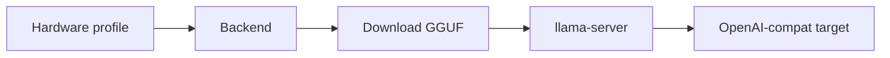

# The local subsystem

The goal: running a model on your own machine should be one target string, with the same
guarantees as a hosted call.

<div class="anyinfer-hero-diagram" markdown>

</div>

```python
result = client.generate(prompt, target="llama-cpp:qwen2.5-7b-instruct-q4-k-m")
```

Behind that call: resolve the artifact from the catalog → download and verify it → detect
the hardware → tune a server for it → start it on loopback → speak the OpenAI dialect →
answer. Six components, composed once so applications do not compose them.

## Hardware detection is advisory

```python
from anyinfer import local

profile = local.detect()
profile.total_ram_bytes        # 136_365_211_648
profile.primary_accelerator    # Accelerator(kind='cuda', total_vram_bytes=..., ...)
profile.warnings               # everything that could not be determined, and why
```

Detection **proposes**; callers decide. Every probe is best-effort — a missing tool, a
permission error, or unparseable output produces a warning and a `None` field, never an
exception. A wrong number here would silently mis-tune a server, so unknown is always
preferred to guessed.

Results are disk-cached, keyed by a signature of the probe executables themselves, so
installing a GPU driver invalidates the cache without you knowing you had to. Override with
`ANYINFER_HARDWARE_CACHE_BYPASS` or `ANYINFER_HARDWARE_CACHE_REFRESH`.

## Tuning explains itself

```python
plan = local.plan_server(
    profile,
    local.TuningInputs(artifact_size_bytes=4_680_000_000, parameter_size="7B"),
    posture="balanced",
)

plan.context_size        # 32768
for line in plan.rationale:
    print(line)
# offloading all layers to the cuda device
# 24.0 GiB of VRAM: budgeting 11.2 GiB for the KV cache after 4.4 GiB of weights
# using 4 CPU threads
```

Postures — `conservative`, `balanced`, `aggressive` — control how much of the machine to
commit. Aggressive additionally enables a `q8_0` KV cache and two concurrent slots.

Two subtleties the tuner gets right, both of which cause real failures when missed:

- **KV cache scales with concurrency.** llama.cpp spreads `--ctx-size` across `--parallel`
  slots, so the real footprint is `context × parallel`. Budgeting one slot then serving two
  is how a "fits comfortably" plan runs out of VRAM.
- **Weights are resident too.** The KV budget is what remains *after* the model, not the
  whole device.

## Downloads are verified and resumable

Model files are large, slow to fetch, and catastrophic to get subtly wrong — a truncated
GGUF fails at load time with an error that says nothing about the download. So every
artifact is:

- **pinned** — URL and SHA-256 come from the catalog, not the network;
- **verified** — hashed before it is ever considered present;
- **atomic** — bytes land in a `.part` file, renamed only after verification;
- **resumable** — an interrupted transfer continues with a range request;
- **lock-guarded** — concurrent processes cooperate instead of corrupting each other.

Sharded artifacts are handled as one unit. Progress surfaces as `DownloadProgress`
telemetry events to the client's observers, and to a `progress` callback when one is
configured in the provider options.

## Supervision

The supervisor's semantics come from studying how comparable local multiplexers fail:

- **Swaps are serialized.** Two requests for two unloaded models do not race — the first
  loads, the second waits. Racing means two full model loads competing for the same VRAM,
  and both lose.
- **Requests block until ready.** You never get a 503 because a model happened to be
  loading. The wait is bounded by a health-check timeout.
- **"Loading" and "failed" are distinguished.** The child's output is captured, so a broken
  model reports *why* instead of looking like a slow one for the full timeout.
- **The idle timer keys on active streams, not last-request time.** A long generation with
  no *new* requests is not idle — keying on request arrival kills work mid-flight.
- **VRAM admission is checked before spawning.** A model that provably will not fit is
  refused with a clear message rather than crashing the child with an OOM.
- **Reaping is verified.** A process is not gone because we asked it to stop; on Windows a
  launcher can exit while the server it spawned keeps the port and the GPU.

Servers bind `127.0.0.1` only. A non-loopback bind requires `allow_remote_exposure=True`.

## Tier recommendation

```python
recommendation = local.recommend_alias(profile, ai.load_default_catalog())
recommendation.alias        # "large"
recommendation.reason       # "24 GiB of VRAM comfortably fits the large tier"
recommendation.confident    # False when memory could not be determined
```

Requirements live in the catalog as data, so updating a recommendation is a catalog change
rather than a code change. Unknowns never inflate the recommendation.

## What is *not* here

No bundled binaries or weights, ever — llama-server runtimes and GGUF files are
runtime-fetched by design, which keeps wheels small and the GPU build matrix out of the
dependency tree.

!!! tip "Key takeaways"
    - Hardware detection is advisory: every probe is best-effort, and unknown is always
      preferred to a guessed number that could mis-tune a server.
    - Downloads are pinned, hash-verified, atomic, and resumable — never a "trust the URL"
      fetch of a large binary artifact.
    - Servers bind loopback only by default; supervision handles swaps, readiness, and
      VRAM admission so applications never compose those themselves.

## See also

<div class="anyinfer-see-also" markdown>

- [How-to: run a local model end to end](../guides/local-inference.md)
- [llama-cpp provider](../providers/llama-cpp.md) · [ollama provider](../providers/ollama.md)

</div>
