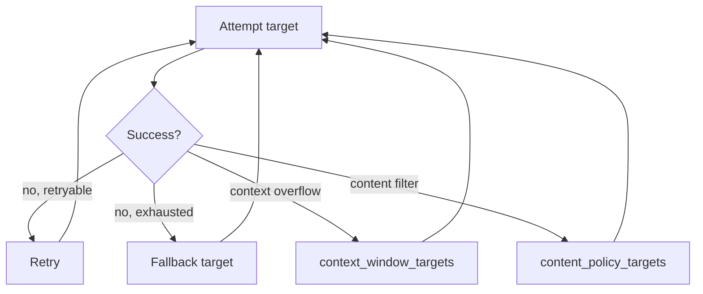

# Routing

Retries, fallback chains, and health gating. Deterministic, bounded, and fully traceable
after the fact.

<div class="anyinfer-hero-diagram" markdown>

</div>

## A route is a policy object

```python
route = ai.Route(
    targets=("anthropic:claude-sonnet-4-5", "openai:gpt-5", "ollama:qwen3:8b"),
    retry=ai.Retry(max_attempts=3, backoff_base_s=0.5, backoff_max_s=30.0),
    health_gate=True,
    health_ttl_s=30.0,
)

result = client.generate(prompt, route=route)
```

Targets are tried **in order**. Each gets up to `max_attempts` tries before the router moves
on. There is no scoring, load balancing, or adaptive selection — that is deferred by
decision, and `Route` is a policy object precisely so it can be added later without changing
any client method.

## What gets retried

The default predicate declines failures that repetition cannot fix:

| Failure | Retried? |
|---|---|
| `RateLimitError` (429) | Yes, honoring `Retry-After` |
| `TransportError` (timeout, connection) | Yes |
| `ProviderUnavailableError` (5xx) | Yes |
| `AuthError` (401/403) | **No** — the same key will fail the same way |
| `ContextLengthError` | **No** — the same prompt is the same size |
| `ModelNotFoundError` (404) | **No** |

Retrying a deterministic failure burns budget a genuinely transient one might have needed.

Override it when you know better:

```python
ai.Retry(retry_on=lambda error: error.http_status == 503)
```

## Backoff

Exponential from `backoff_base_s`, raised to the server's `Retry-After` when that is longer,
capped by `backoff_max_s`. Honoring the server's advice is the difference between backing
off and getting banned.

## Failure-specific fallback chains

The right *next* target depends on why the last one failed. A context overflow needs a
larger model, not another same-sized one — and a content-policy refusal needs a
differently-governed provider, not a retry:

```python
route = ai.Route(
    targets=("openai:gpt-5-mini",),
    context_window_targets=("anthropic:claude-sonnet-4-5",),   # bigger context
    content_policy_targets=("ollama:qwen3:8b",),               # different governance
)
```

When a `ContextLengthError` occurs, the router switches to `context_window_targets` instead
of continuing down the general chain.

When a generation finishes with `finish_reason == "content_filter"`, the router discards
the refusal and redirects to `content_policy_targets` — at most once per request, and
never after streamed text from the refusing attempt has already reached your consumer
(a silent restart would contradict what you rendered). The redirected attempt is recorded
with outcome `"redirected"` in the attempt trail. If the chain refuses too, that refusal
surfaces normally.

## Health gating

A target that recently failed with a transport or availability error is skipped for
`health_ttl_s` seconds — the [health gate](../reference/glossary.md#health-gate) — rather
than costing every subsequent request its full timeout:

```python
result.attempts
# [AttemptRecord(target=..., outcome="skipped_unhealthy"),
#  AttemptRecord(target=..., outcome="ok")]
```

The TTL is short on purpose: a stale "unhealthy" verdict is worse than one extra failed
attempt. Health state is keyed per `provider:model`, so one bad model does not gate a
provider's others.

Disable it when you want every target attempted:

```python
ai.Route(targets=(...), health_gate=False)
```

## The attempt trail

Every result carries its complete routing history:

```python
for attempt in result.attempts:
    print(attempt.target, attempt.outcome)
    if attempt.error:
        print("   ", attempt.error.type_name, attempt.error.detail)
```

Outcomes are `"ok"`, `"retried"`, `"failed"`, `"skipped_unhealthy"`, or `"redirected"`.
This is what makes
"why was that request slow?" answerable in production.

When everything fails:

```python
try:
    result = client.generate(prompt, route=route)
except ai.AllTargetsFailedError as error:
    for attempt in error.attempts:
        log.warning("%s: %s", attempt.target, attempt.error and attempt.error.detail)
```

## What is *not* a routing failure

A schema violation raises `SchemaViolationError` directly and does **not** trigger fallback.
The request reached the model and the model answered — it just answered the wrong shape, and
sending it to a different provider addresses the wrong problem. Use
[repair](structured-output.md#repair) for that.

Similarly, a mid-stream protocol error *after content has already been emitted* is raised
rather than retried: the consumer has already seen text, and silently restarting would
duplicate or contradict it.

!!! tip "Key takeaways"
    - Targets are tried in order with no scoring or load balancing — a `Route` is a policy
      object precisely so smarter selection can be added later without a new client method.
    - Only failures repetition can plausibly fix are retried; auth and context-length errors
      are not.
    - Every result carries its full attempt trail, so "why was this slow?" is answerable
      after the fact.

## See also

<div class="anyinfer-see-also" markdown>

- [The event stream](events.md) — `AttemptFailed` events during routing.
- [Error catalog](../reference/errors.md) — every error and its retry semantics.

</div>
