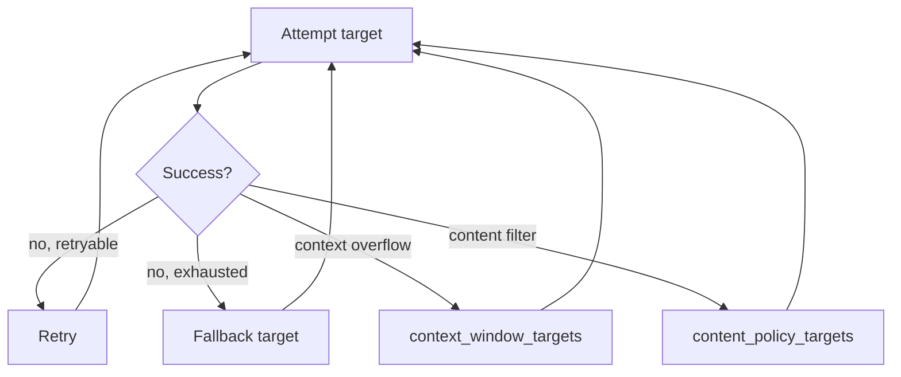

# Routing and rate limits

A route decides where a request goes and what happens when an attempt fails: retries,
fallback chains, and health gating, all deterministic and fully traceable afterward.
Rate limiting is the other half of the same concern — pacing dispatch so a predictable
429 never arrives. Both live here.

<div class="anyinfer-hero-diagram" markdown>

</div>

## A route is a policy object

```python
route = ai.Route(
    targets=("anthropic:claude-sonnet-4-5", "openai:gpt-5", "ollama:qwen3:8b"),
    retry=ai.Retry(max_attempts=3, backoff_base_s=0.5, backoff_max_s=30.0),
    health_gate=True,
    health_ttl_s=30.0,
)

result = client.generate(prompt, route=route)
```

Targets are tried in order. Each gets up to `max_attempts` tries before the router moves
on. There is no scoring, load balancing, or adaptive selection; `Route` is a policy
object precisely so smarter selection could be added later without changing any client
method.

## Naming a target does not discard your policy

A route configured on the client governs calls that do not name a route of their own,
and it keeps governing them when a call redirects itself with `target=`:

```python
client = ai.AsyncClient(providers, route=ai.Route(
    targets=("anthropic:claude-sonnet-4-5",),
    retry=ai.Retry(max_attempts=5),
))

# Still five attempts. `target=` changed where the call goes, not how it is governed.
result = await client.generate(prompt, target="openai:gpt-5")
```

The same holds for target-shaped spellings of `route=` (a single string, or a sequence of
them) and for a [session's](sessions.md) target: they name targets and say nothing about
policy, so the policy in force carries. To depart from the client's defaults, pass a
fully constructed `Route` — that is a complete statement of policy, honored exactly as
written.

The specialized chains are the exception: `context_window_targets` and
`content_policy_targets` name other providers, and quietly redirecting to a target the
caller did not ask for would be the same surprise pointing the other way. They are never
inherited by a call that names its own target.

## What gets retried

The default predicate declines failures that repetition cannot fix, since retrying a
deterministic failure burns budget a transient one might have needed:

| Failure | Retried? |
|---|---|
| `RateLimitError` (429) | Yes, honoring `Retry-After` |
| `TransportError` (timeout, connection) | Yes |
| `ProviderUnavailableError` (5xx) | Yes |
| `AuthError` (401/403) | No — the same key will fail the same way |
| `ContextLengthError` | No — the same prompt is the same size |
| `ModelNotFoundError` (404) | No |

Override it when you know better:

```python
ai.Retry(retry_on=lambda error: error.http_status == 503)
```

Backoff is exponential from `backoff_base_s`, raised to the server's `Retry-After` when
that is longer, and capped by `backoff_max_s`. The
[error catalog](../reference/errors.md) records the retry semantics of every error type.

## Failure-specific fallback chains

The right *next* target depends on why the last one failed. A context overflow needs a
larger model, not another same-sized one, and a content-policy refusal needs a
differently-governed provider, not a retry:

```python
route = ai.Route(
    targets=("openai:gpt-5-mini",),
    context_window_targets=("anthropic:claude-sonnet-4-5",),  # bigger context
    content_policy_targets=("ollama:qwen3:8b",),  # different governance
)
```

On a `ContextLengthError`, the router switches to `context_window_targets` instead of
continuing down the general chain. When a generation finishes with
`finish_reason == "content_filter"`, the router discards the refusal and redirects to
`content_policy_targets` — at most once per request, and never after streamed text from
the refusing attempt has reached your consumer, since a silent restart would contradict
what you already rendered. The redirected attempt is recorded with outcome
`"redirected"`. If the chain refuses too, that refusal surfaces normally.

## Health gating

A target that recently failed with a transport or availability error is skipped for
`health_ttl_s` seconds — the [health gate](../reference/glossary.md#health-gate) — rather
than costing every subsequent request its full timeout:

```python
result.attempts
# [AttemptRecord(target=..., outcome="skipped_unhealthy"),
#  AttemptRecord(target=..., outcome="ok")]
```

The TTL is short on purpose: a stale "unhealthy" verdict costs more than one extra
failed attempt. Health state is keyed per `provider:model`, so one bad model does not
gate a provider's others. Disable it with `health_gate=False` when you want every target
attempted.

## The attempt trail

Every result carries its complete routing history:

```python
for attempt in result.attempts:
    print(attempt.target, attempt.outcome)
    if attempt.error:
        print("   ", attempt.error.type_name, attempt.error.detail)
```

Outcomes are `"ok"`, `"retried"`, `"failed"`, `"skipped_unhealthy"`, or `"redirected"`.
This is what makes "why was that request slow?" answerable in production. When
everything fails:

```python
try:
    result = client.generate(prompt, route=route)
except ai.AllTargetsFailedError as error:
    for attempt in error.attempts:
        log.warning("%s: %s", attempt.target, attempt.error and attempt.error.detail)
```

## What is not a routing failure

A schema violation raises `SchemaViolationError` directly and does not trigger fallback.
The request reached the model and the model answered — it just answered the wrong shape,
and sending it to a different provider addresses the wrong problem. Use
[repair](structured-output.md#repair) for that. Note that
[embedding and rerank routes](embeddings.md) fall back under a stricter rule, because
two models' vectors are not interchangeable.

Similarly, a mid-stream protocol error after content has been emitted is raised rather
than retried: the consumer has already seen text, and a silent restart would duplicate
or contradict it.

## Pacing before the limit

Everything above reacts to failure. Rate limiting anticipates one kind: an
`asyncio.gather` over a hundred requests would otherwise send a hundred requests, take a
wall of 429s, and only then back off. Client-side pacing is opt-in — with no limits
configured, requests dispatch exactly as before.

Limits belong to a provider instance, not to the application, because a rate limit is a
property of an account at a provider. Two instances on two keys have two independent
allowances:

```python
client = ai.Client(
    [
        ai.ProviderSettings.of(
            "openai",
            api_key="env://OPENAI_API_KEY",
            limits=ai.RateLimits(max_concurrent=8, requests_per_minute=300),
        ),
    ]
)
```

The same `limits` block appears in the
[shared configuration file](../reference/configuration.md), so the CLI and sidecar pace
identically.

| Field | Default | What it does |
|---|---|---|
| `max_concurrent` | unbounded | Most requests in flight at once. The permit is held for the whole exchange, streaming included |
| `requests_per_minute` | unset | Sustained rate, enforced as a token bucket, so a small burst is allowed and then paced |
| `min_interval_s` | `0` | Smallest gap between two dispatches, for providers that object to bursts regardless of rate |
| `respect_headers` | `true` | Slow down when the provider's own headers say its window is nearly spent |
| `reserve_fraction` | `0` | Fraction of the provider's stated allowance to leave untouched |

`reserve_fraction` matters whenever this process is not the only consumer of the key:
spending down to the last request in a window means whichever other consumer arrives
next is the one that gets throttled.

Pacing is bounded to one process. There is no shared state across workers or hosts, no
quota enforcement beyond what you configure, and no routing around a busy provider —
choosing a different target because one is throttled would be load balancing, which
AnyInfer does not do.

### Learning from the provider

Providers publish their remaining allowance in response headers. Which headers a
provider uses is declared on its descriptor and recorded in its contract snapshot
(OpenAI uses durations like `6m0s`; Anthropic uses RFC 3339 instants). Every derived
wait is clamped, so a skewed clock costs a bounded pause rather than a hang. A provider
that declares no header dialect is paced by your configured bounds alone. Asking for
`respect_headers` where it cannot work produces a
[`ParameterDropped` event](telemetry.md) saying so.

### Seeing the wait

A paced request looks slow, so the wait is reported in the result and in the event
stream:

```python
result.timing.phases.get("queued_ms")  # present only when this request waited


def observer(event):
    if isinstance(event, ai.RateLimitWaited):
        print(f"{event.provider_id} held a request {event.waited_s:.2f}s ({event.reason})")


client.events.subscribe(observer)
```

`reason` is one of `concurrency`, `interval`, or `provider-headers`, so a slow fan-out
can be attributed to the bound that caused it. `anyinfer doctor` prints the configured
limits for the same reason.

One interaction worth knowing: queue time counts against the request's own `timeout_s`.
Aggressive pacing and a tight timeout will fight each other, so raise `timeout_s` when
you pace hard.

!!! tip "Key takeaways"
    - Targets are tried in order with no scoring or load balancing; only failures that
      repetition can plausibly fix are retried.
    - Per-call `target=` changes where a request goes, not how it is governed — the
      client route's retry and health policy still apply.
    - Every result carries its full attempt trail, and every pacing wait appears as
      `queued_ms` and a typed event, so slowness is attributable after the fact.
    - Rate limits are opt-in, per provider instance, and pace one process; they never
      reroute a request or invent a quota the provider did not state.

## See also

<div class="anyinfer-see-also" markdown>

- [The event stream](events.md): `AttemptFailed` and `RateLimitWaited` during a request.
- [Error catalog](../reference/errors.md): every error and its retry semantics.
- [Cost and spending](cost.md): the other ceiling a client can carry.

</div>
