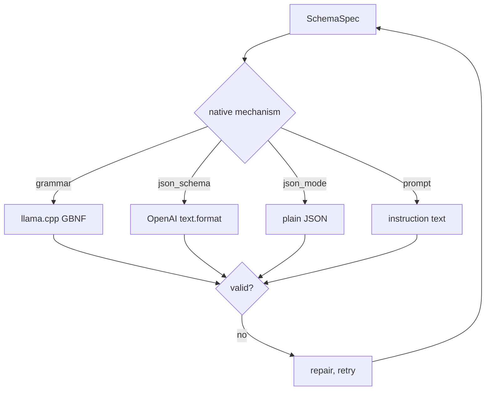

# Structured output

A schema is a **contract**, not a hint. Pass one and you get back a value that satisfies it,
or an error explaining why not — never a "mostly right" string you have to re-parse.

<div class="anyinfer-hero-diagram" markdown>

</div>

```python
PERSON = {
    "type": "object",
    "properties": {"name": {"type": "string"}, "age": {"type": "integer"}},
    "required": ["name", "age"],
}

result = client.generate(prompt, target="medium", schema=PERSON)
result.structured        # {"name": "Ada", "age": 36} — already validated
```

Pydantic models work too, via duck typing — AnyInfer takes no pydantic dependency:

```python
result = client.generate(prompt, target="medium", schema=MyPydanticModel)
```

## How it works

Three steps, and the third is the one that matters.

**1. Pick the strongest mechanism the model supports.**

```
grammar  >  json_schema  >  json_mode  >  prompt
```

| Mechanism | What it does | Who has it |
|---|---|---|
| `grammar` | Constrains decoding so invalid tokens cannot be produced | llama.cpp, Ollama |
| `json_schema` | Provider validates against the schema | OpenAI, Azure, Anthropic (emulated) |
| `json_mode` | Provider guarantees *some* valid JSON | Several |
| `prompt` | The schema is described in the system prompt | Everywhere |

Unknown capabilities fall to `prompt`, which works everywhere — an unrecognized model
degrades to something that still produces a validated result rather than failing outright.

The chosen mechanism is recorded on the result:

```python
result.structured_mechanism   # "grammar"
```

**2. Project the schema for that provider.**

Grammar-based engines choke on constructs that are cheap for a validator but expensive for a
grammar — string length bounds, very large array bounds — so those are stripped *for the
wire only*.

**3. Validate the response against your original schema.**

Always. Regardless of mechanism, regardless of what the provider claimed. This is
non-negotiable for a specific reason: backends have shipped bugs where structured-output
enforcement is *silently disabled* under certain conditions (thinking modes, in particular),
producing unconstrained output with no error. A provider's claim that it constrained the
output is not evidence that it did.

Stripping a constraint in step 2 therefore never weakens what you get — the original schema
is what decides.

## Grammar mode still describes the schema in the prompt

A GBNF grammar guarantees *well-formed* JSON, not *meaningful* JSON. A model that was never
shown the schema will happily emit schema-shaped nonsense that satisfies the grammar and
fails you.

So for engines whose grammar mode does not condition the model — llama.cpp and Ollama —
AnyInfer injects the schema into the prompt **as well as** compiling the grammar. This is a
descriptor property, not a blanket rule: providers whose `json_schema` mode already
conditions the model do not need it.

## Repair

Opt in to letting the model correct itself — see
[repair](../reference/glossary.md#repair) in the glossary:

```python
result = client.generate(
    prompt,
    target="medium",
    schema=PERSON,
    repair=ai.Repair(max_attempts=1),
)

result.repair_attempts   # 0 if it got it right the first time
```

On a violation, AnyInfer re-prompts **the same model** with the validation errors appended.
It does not fall back to a different provider: a schema violation says something about the
model's output, not the endpoint's health, and fallback would spend the routing budget on a
problem fallback cannot fix.

The budget is bounded. When it is exhausted:

```python
try:
    result = client.generate(prompt, schema=PERSON, target="medium")
except ai.SchemaViolationError as error:
    print(error.errors)     # ("age: 'age' is a required property",)
    print(error.raw_text)   # what the model actually said
```

You get the validation errors, bounded raw output, and—when a truncated top-level JSON
object contains delimiter-confirmed complete members—`error.partial` plus
`error.missing_fields`. Partial members are evidence, not a valid result: AnyInfer never
guesses a cut-off scalar, asks another provider to continue it, or treats recovered fields
as schema-validated.

### Some providers cap the budget

The budget is the caller's to set, and for almost every provider it stays that way. A few
declare a ceiling, because a repair round trip costs them far more than a malformed answer
is worth: Microsoft 365 Copilot allows one, since every request is a Graph call against a
service-held conversation behind an interactively-acquired token.

The clamp is never silent. Asking for three where the provider allows one emits a
[`ParameterDropped`](telemetry.md) event naming `repair.max_attempts`, so a budget reduced
behind your back is as discoverable as a parameter ignored outright:

```python
ai.ParameterDropped(
    parameter="repair.max_attempts",
    reason="m365-copilot allows at most 1 schema-repair round trip(s); 3 requested",
    ...
)
```

## Extraction is forgiving; validation is not

Models wrap JSON in code fences and prose even when told not to. Extraction handles that —
it tries the whole string, then scans for the first balanced `{...}` or `[...]`, respecting
string literals so a brace inside a string does not end the scan.

Validation, once a value is extracted, is strict.

!!! tip "Key takeaways"
    - A schema is a contract: you always get a client-side-validated value, regardless of
      which mechanism produced it.
    - The strongest native mechanism is chosen automatically — grammar beats json_schema
      beats json_mode beats prompt — and the choice is recorded on the result.
    - Repair is opt-in, bounded, and re-prompts the same model; it never triggers fallback.

## See also

<div class="anyinfer-see-also" markdown>

- [Capabilities](capabilities.md) — how mechanism selection knows what a model supports.
- [How-to: enforce a JSON schema](../guides/structured-output.md)

</div>
