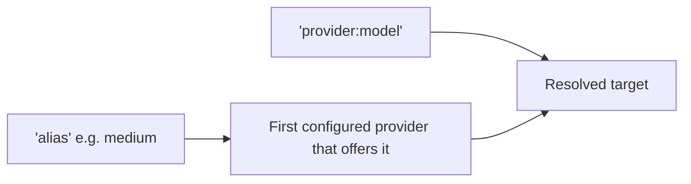

# Targets and aliases

A **[target](../reference/glossary.md#target)** says where a request goes. There are two
spellings and one resolution path.

<div class="anyinfer-hero-diagram" markdown>

</div>

## `provider:model`

```python
client.generate(prompt, target="anthropic:claude-sonnet-4-5")
client.generate(prompt, target="ollama:qwen3:8b")
```

The string is split on the **first** colon only, because model names legitimately contain
colons — `"ollama:qwen3:8b"` is the provider `ollama` and the model `qwen3:8b`.

Provider names normalize (lowercased, trimmed, `_` → `-`) and honor aliases, so
`"Claude:claude-sonnet-4-5"` and `"anthropic:claude-sonnet-4-5"` are the same target.

## Aliases

An alias is a tier name that resolves to a concrete model per provider:

```python
client.generate(prompt, target="medium")
```

The bundled catalog ships `small`, `medium`, and `large`. Which provider serves an alias is
determined by **the order you configured providers**:

```python
client = ai.Client([
    ai.ProviderSettings.of("ollama"),        # tried first
    ai.ProviderSettings.of("anthropic", api_key="env://ANTHROPIC_API_KEY"),
])

client.generate(prompt, target="medium")      # -> ollama:qwen3:4b
```

Reverse that list and `medium` resolves to Anthropic instead. The rule is deliberately
boring: **first configured provider that offers the alias wins**. Nothing is scored, ranked,
or chosen for you, so the same code makes the same choice every time.

### Why aliases exist

They let an application offer "pick a size" instead of "pick a model id" — and they let you
change which model backs a tier without touching application code. Catalog entries are data;
application code refers to tiers.

## Resolution is total

Resolution either produces a concrete target or raises a `ConfigError` telling you what to
do instead. It never silently substitutes a different model:

```python
client.generate(prompt, target="gpt-5")
# ConfigError: unknown target 'gpt-5'
#   (hint: use 'provider:model' (e.g. 'anthropic:claude-sonnet-5'),
#          or one of these aliases: large, medium, small)
```

You can resolve without issuing a request:

```python
resolved = client.resolve("medium")
print(resolved.provider_id, resolved.model, resolved.via_alias)
# ollama qwen3:4b medium
```

## Proving a target actually works

Resolving a target says it is *spelled* correctly. It says nothing about whether the
credential behind it can generate, whether the model id exists at that endpoint, or whether
the deployment has capacity — and a health probe does not either, because everything a
health probe touches can be fine while inference still fails.

`verify()` spends one deliberately tiny request to find out, and reports rather than raises:

```python
result = client.verify("openai:gpt-5")

result.ok         # answered, in the shape asked for, with the expected content
result.reached    # answered at all
result.detail     # what went wrong, when something did
result.target     # which model actually served it — meaningful for "auto"
```

The two booleans are separate on purpose, because the fixes are different:

| `reached` | `ok` | What it means |
|---|---|---|
| `False` | `False` | Nothing answered. Wrong endpoint, bad credential, no capacity. |
| `True` | `False` | The connection is fine; the model could not hold the requested shape. |
| `True` | `True` | Good. |

Verification also carries whatever the provider said about
[its own runtime](capabilities.md#runtime-diagnostics), so a target that works *slowly*
does not read as a target that simply works. The CLI wraps the same call as
[`anyinfer verify`](../guides/cli.md#checking-a-target-actually-works).

## Overriding the catalog

Applications overlay their own catalog; app entries win:

```python
from anyinfer.catalog import Catalog

overlay = Catalog.from_mapping({
    "format_version": 1,
    "aliases": {
        "medium": {
            "description": "our pinned medium tier",
            "targets": {"anthropic": {"model": "claude-sonnet-4-5"}},
        }
    },
})

client = ai.Client(providers, catalog=ai.load_default_catalog().overlay(overlay))
```

An overridden alias replaces the bundled one wholesale rather than merging its target map,
so you can *remove* a provider from a tier you do not want used.

Pinning your own catalog is also how you insulate yourself from bundled-catalog churn.

## Targets are OpenAI model strings

Every target spelling fits in an OpenAI `model` field, which is what makes the
[sidecar](../serve/README.md) able to federate without inventing a routing syntax:

```bash
curl localhost:8080/v1/chat/completions \
  -d '{"model": "ollama:qwen3:8b", "messages": [{"role": "user", "content": "hi"}]}'
```

This is enforced by a round-trip test, not just intended.

!!! tip "Key takeaways"
    - A target is either `provider:model` or a catalog alias; both resolve through the
      same path, and resolution either succeeds concretely or raises `ConfigError`.
    - Alias resolution order is boring on purpose: first configured provider that offers
      the alias wins, every time.
    - Every target spelling is a valid OpenAI `model` string, which is what lets the serve
      frontend federate without inventing a routing syntax.

## See also

<div class="anyinfer-see-also" markdown>

- [Routing](routing.md) — a `Route` is an ordered list of targets plus policy.
- [Capabilities](capabilities.md) — what is known about a resolved model.

</div>
