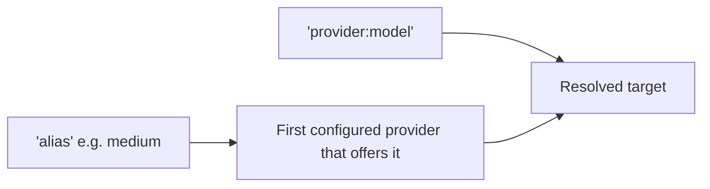

# Targets and Aliases

A **[target](../reference/glossary.md#target)** says where a request goes. There are two
spellings and one resolution path.

<div class="anyinfer-hero-diagram" markdown>

</div>

## `provider:model`

```python
client.generate(prompt, target="anthropic:claude-sonnet-4-5")
client.generate(prompt, target="ollama:qwen3:8b")
```

The string is split on the **first** colon only, because model names legitimately contain
colons: `"ollama:qwen3:8b"` is the provider `ollama` and the model `qwen3:8b`.

Provider names normalize (lowercased, trimmed, `_` → `-`) and honor aliases, so
`"Claude:claude-sonnet-4-5"` and `"anthropic:claude-sonnet-4-5"` are the same target.

## Aliases

An alias is a tier name that resolves to a concrete model per provider:

```python
client.generate(prompt, target="medium")
```

The bundled catalog ships `small`, `medium`, and `large`. Which provider serves an alias is
determined by **the order providers were configured**:

```python
client = ai.Client(
    [
        ai.ProviderSettings.of("ollama"),  # tried first
        ai.ProviderSettings.of("anthropic", api_key="env://ANTHROPIC_API_KEY"),
    ]
)

client.generate(prompt, target="medium")  # -> ollama:qwen3:4b
```

Reverse that list and `medium` resolves to Anthropic instead. The rule is deliberately
boring: **first configured provider that offers the alias wins**. Nothing is scored, ranked,
or chosen on the application's behalf, so the same code makes the same choice every time.

### Why Aliases Exist

They allow an application to offer "pick a size" instead of "pick a model id", and allow a
developer to change which model backs a tier without touching application code. Catalog entries are data;
application code refers to tiers.

## Resolution Is Total

Resolution either produces a concrete target or raises a `ConfigError` telling the caller
what to do instead. It never silently substitutes a different model:

```python
client.generate(prompt, target="gpt-5")
# ConfigError: unknown target 'gpt-5'
#   (hint: use 'provider:model' (e.g. 'anthropic:claude-sonnet-4-5'),
#          or one of these aliases: large, medium, small)
```

A target can be resolved without issuing a request:

```python
resolved = client.resolve("medium")
print(resolved.provider_id, resolved.model, resolved.via_alias)
# ollama qwen3:4b medium
```

## Proving a Target Actually Works

Resolving a target says it is spelled correctly, nothing more. `verify()` spends one
tiny request to prove the credential, model, and deployment actually serve, and
`probe()` measures features on compatibility endpoints; both are covered in
[proving a target works](capabilities.md#proving-a-target-works). The CLI wraps the
first as [`anyinfer verify`](../guides/cli.md#checking-a-target-actually-works).

## Overriding the Catalog

Applications overlay their own catalog; app entries win:

```python
from anyinfer.catalog import Catalog

overlay = Catalog.from_mapping(
    {
        "format_version": 1,
        "aliases": {
            "medium": {
                "description": "our pinned medium tier",
                "targets": {"anthropic": {"model": "claude-sonnet-4-5"}},
            }
        },
    }
)

client = ai.Client(providers, catalog=ai.load_default_catalog().overlay(overlay))
```

An overridden alias replaces the bundled one wholesale rather than merging its target map,
so a provider can be *removed* from a tier that should not be used.

Pinning a catalog is also how an application insulates itself from bundled-catalog churn.

## Targets Are OpenAI Model Strings

Every target spelling fits in an OpenAI `model` field, which is what makes the
[sidecar](../serve/README.md) able to federate without inventing a routing syntax:

```bash
curl localhost:8080/v1/chat/completions \
  -d '{"model": "ollama:qwen3:8b", "messages": [{"role": "user", "content": "hi"}]}'
```

This is enforced by a round-trip test, not just intended.

!!! tip "Key Takeaways"
    - A target is either `provider:model` or a catalog alias; both resolve through the
      same path, and resolution either succeeds concretely or raises `ConfigError`.
    - Aliases resolve to the first configured provider that offers them, every time;
      nothing is scored or chosen on the application's behalf.
    - Every target spelling is a valid OpenAI `model` string, which is what lets the serve
      frontend federate without inventing a routing syntax.

## See Also

<div class="anyinfer-see-also" markdown>

- [Routing and rate limits](routing.md): a `Route` is an ordered list of targets plus
  policy.
- [Capabilities](capabilities.md): what is known about a resolved model, and how to
  verify or probe it.
- [The model catalog](catalog.md): where aliases and their tier data live.

</div>
