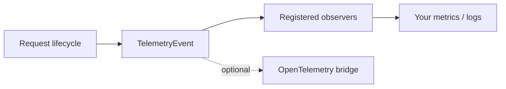

# Telemetry and observers

The telemetry contract is **typed in-process events delivered to registered observers**.
OpenTelemetry is an optional bridge over that contract, not the contract itself.

Nothing is written anywhere by default. A deployment that wants zero telemetry pays nothing,
including no dependency.

<div class="anyinfer-hero-diagram" markdown>

</div>

## Subscribing

```python
class Recorder:
    def on_event(self, event: ai.TelemetryEvent) -> None:
        match event:
            case ai.FirstToken(at_ms=ms):
                metrics.ttft.observe(ms)
            case ai.RequestCompleted(usage=usage, timing=timing):
                metrics.tokens.inc(usage.output_tokens or 0)
            case ai.RequestFailed(error=error):
                log.warning("request failed: %s", error.detail)


client = ai.Client(providers, observers=[Recorder()])
# or later:
client.subscribe(Recorder())
```

Observers are synchronous and dispatched inline, so keep `on_event` fast — queue anything
slow. An observer that raises is isolated: the exception is swallowed and warned about once,
because a broken telemetry sink must never fail a generation.

## The events

**Request lifecycle:** `RequestStarted` · `TargetResolved` · `AttemptStarted` · `FirstToken`
· `AttemptCompleted` · `RetryScheduled` · `FallbackTriggered` · `RepairAttempted` ·
`RequestCompleted` · `RequestFailed`

**Degradation** — the ones that make silent failures visible:

| Event | Emitted when |
|---|---|
| `ParameterDropped` | A provider accepts a parameter and discards it, or honors it only in part. |
| `UsageEstimated` | A usage figure was derived rather than reported. |
| `ProviderDiagnostic` | A provider reported something about its own runtime. |

Anything AnyInfer drops or estimates is observable. That is a deliberate inversion of the
common `drop_params=True`-style design, where the whole point is that you *do not* find out.

`ProviderDiagnostic` covers the case the other two cannot: the request worked, nothing was
dropped or estimated, and it still took thirty seconds because the model had spilled out of
VRAM since yesterday. See [runtime diagnostics](capabilities.md#runtime-diagnostics).

**Context reduction:** `ContextReduced` — counts and ceilings only, never content.

**Local subsystem:** `ServerLifecycle` · `DownloadProgress`

## Payloads are off by default

Prompt and response text are `None` unless an observer explicitly opts in:

```python
client.subscribe(audit_log, payloads=True)  # sees prompt and response text
client.subscribe(metrics)  # never does
```

Stripping happens **per observer**, so one payload-consuming sink does not leak text to the
others. Everything still passes redaction first.

## Correlating events

Every request-lifecycle event carries a `request_id`. A fallback chain that tried three
targets emits one `RequestStarted` and one terminal event with the same id, so a trace reads
as a single request rather than three disconnected ones.

## The OpenTelemetry bridge

```python
from anyinfer import otel

otel.install(client)  # spans and metrics, payload-free
```

Requires the `[otel]` extra; nothing OTel-related is imported otherwise. What the bridge
emits — one span per request, attempts as span events, GenAI semantic-convention metrics —
is covered in [the observability guide](../guides/observability.md#opentelemetry).

The bridge is one consumer of the event contract. Applications that want structured data
in-process — a JSONL trail, a SQLite evidence table — consume the events directly rather
than round-tripping through spans.

!!! tip "Key takeaways"
    - Telemetry is typed in-process events to registered observers; OpenTelemetry is an
      optional bridge, not the contract itself.
    - Prompt and response payloads are off by default, per observer, so one consumer's
      opt-in never leaks text to another.
    - Degradation is observable by design: `ParameterDropped` and `UsageEstimated` exist
      so silent failures in comparable gateways can't happen here.

## See also

<div class="anyinfer-see-also" markdown>

- [The event stream](events.md): the *other* event channel, for response content.
- [Capabilities](capabilities.md): why `ParameterDropped` exists.
- [How-to: observability](../guides/observability.md)

</div>
