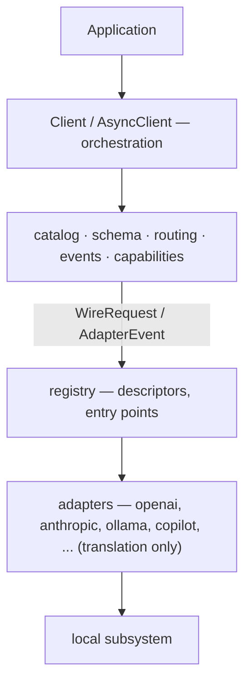

# Architecture

The condensed version. [DESIGN.md](https://github.com/anthturner/AnyInfer/blob/main/DESIGN.md) §23 has the complete rationale;
[the glossary](../reference/glossary.md) defines the vocabulary these rules use.

## The shape

<div class="anyinfer-hero-diagram" markdown>

</div>

## The load-bearing rules

**1. The primitive is `GenerationRequest → typed event stream`.**
Never make the OpenAI wire format the internal representation. It is one dialect at the
edges. This is what makes the sidecar a thin projection rather than a second core.

**2. Adapters only translate.**
Four methods: `list_models`, `health`, `generate`, `aclose`. Retry, fallback, validation,
repair, timing, usage normalization, cost, telemetry, and redaction live in the core. Thin
adapters are coverable by one shared conformance suite; thick ones are not.
[Writing a provider adapter](writing-an-adapter.md) covers the contract.

**3. Async core, sync facade.**
One implementation. `Client` wraps `AsyncClient` with a background event-loop thread.

**4. llama.cpp is a supervised subprocess.**
No `llama-cpp-python`.

**5. Capability data is provenance-tagged.**
`catalog | discovered | probed | default`. Never present an estimate as authoritative, and
never coerce unknown to zero.

**6. Telemetry is typed in-process events.**
OTel is a lazy optional bridge. Nothing is written anywhere by default; events are
payload-free by default.

**7. Slim core.**
Mandatory dependencies are `httpx2` and `jsonschema`. Everything else is an extra.

**8. Providers register via frozen descriptors.**
Declarative setup specs mean no per-engine `if/elif` in core, config, or UI code.

**9. The sidecar is a wire codec.**
Four invariants, enforced from M0 and round-trip tested: request-surface superset,
event-stream sufficiency, target-in-model-string, concurrent streams. See
[the sidecar](../serve/README.md).

## Enforcement

Three of these are checked mechanically by `lint-imports`, not left to review:

```toml
[[tool.importlinter.contracts]]
name = "Adapters never orchestrate"
source_modules = ["anyinfer.providers"]
forbidden_modules = ["anyinfer.routing", "anyinfer.schema.validate",
                     "anyinfer.schema.repair", "anyinfer._client",
                     "anyinfer.capabilities"]
```

When one fails, move the code. Loosening a contract requires a documented reason — and
`anyinfer.local` is absent from the adapter contract on purpose, because composing the
local subsystem is translation, not orchestration.

## Request lifecycle

1. Resolve the target: alias or `provider:model` → `ResolvedTarget`.
2. Gate on health, if the target recently failed.
3. Assemble capabilities from the layered sources.
4. Build the wire request: choose the mechanism, project the schema, translate reasoning
   effort, inject a schema prompt when needed.
5. Stream adapter events, marking first token and accumulating buffers.
6. Validate structured output against the *original* schema; repair within budget.
7. Assemble the `Generation`: timings, usage, cost, warnings, attempt trail.
8. Emit `StreamEnded`.

On failure: record the attempt, emit `AttemptFailed`, then retry or advance to the next
target. Exhaustion raises `AllTargetsFailedError` with the whole trail.

Behaviors that look like bugs but are intended — unknown cost reported as `None`, no
fallback on a schema violation, a mid-stream error raising after content — are listed in
[the error catalog](../reference/errors.md#things-that-look-like-bugs-but-are-not).
