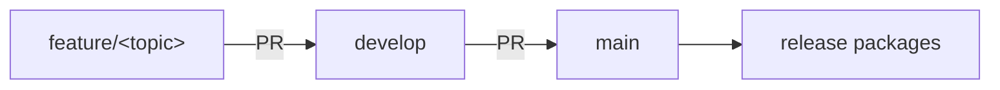

# Branching and releases

How changes travel from a feature branch to a published release, and what is mechanical
versus what a maintainer decides.

## The branch model



- **`feature/*`** — all work happens here, one topic per branch. Branched from `develop`.
- **`develop`** — the integration branch. Feature branches merge in by pull request;
  [CI](https://github.com/anthturner/AnyInfer/blob/main/.github/workflows/ci.yml) must be
  green before the merge button works.
- **`main`** — always releasable. Receives only pull requests from `develop`, again
  gated on CI. Every merge to `main` rebuilds the release packages; a merge that bumps
  the version also publishes them.

Both protected branches require the single aggregate **`ci-ok`** status check, which
passes only when every lint, type, contract, test-matrix, conformance, and docs job
passed. Requiring one stable check name means adding a CI job (or a matrix row) can
never silently escape the protection rules.

### One-time repository setup

Branch protection lives in repository settings, not in files. After pushing the repo:

```bash
# create develop from main
git checkout main && git checkout -b develop && git push -u origin develop

# protect both branches on the aggregate check
for branch in main develop; do
  gh api "repos/{owner}/{repo}/branches/$branch/protection" -X PUT \
    -F 'required_status_checks[strict]=true' \
    -F 'required_status_checks[contexts][]=ci-ok' \
    -F 'required_pull_request_reviews[required_approving_review_count]=0' \
    -F 'enforce_admins=false' \
    -F 'restrictions=null'
done
```

Also set **Settings → Pages → Source** to *GitHub Actions* so the
[docs deploy workflow](https://github.com/anthturner/AnyInfer/blob/main/.github/workflows/pages.yml)
can publish the site.

Finally, set **Settings → Actions → General → Fork pull request workflows from outside
collaborators** to *Require approval for all outside collaborators*. GitHub's default only
gates **first-time** contributors — after one merged PR, a fork's CI runs would start
automatically. With this setting, every fork PR waits for a maintainer to review the diff
and click *Approve and run*; the required `ci-ok` check then blocks the merge until that
run is green. (Fork runs never receive secrets and get a read-only token regardless.)

## Versioning

- The single source of truth is `project.version` in
  [`pyproject.toml`](https://github.com/anthturner/AnyInfer/blob/main/pyproject.toml);
  `anyinfer.__version__` mirrors it and a test keeps them in agreement.
- Pre-1.0, versions follow `0.MINOR.PATCH`: breaking changes bump MINOR, everything else
  bumps PATCH. From 1.0.0 on, plain [SemVer](https://semver.org/).
- Bumping the version is an ordinary change: edit both files on a feature branch and let
  it ride to `main` through `develop`.

## What a release is

The [release workflow](https://github.com/anthturner/AnyInfer/blob/main/.github/workflows/release.yml)
runs on every merge to `main`:

1. It reads `project.version` and checks whether tag `v<version>` already exists.
2. It always rebuilds every release artifact, so `main` is continuously proven releasable:
    - **the library** — sdist + wheel, `twine check`-ed and smoke-installed;
    - **the demo bundles** — standalone PyInstaller builds of the pack-in demo app on
      native runners for Windows (x64), macOS (arm64 and x64), and Linux (x64 and
      arm64), named without a version
      (`anyinfer-demo-<os>-<arch>.zip`) so the site's
      [downloads page](../downloads.md) can link `releases/latest/download/` URLs that
      never go stale;
    - **the sidecar bundles** — native builds on the same runners, named
      `anyinfer-serve-<os>-<arch>.zip`, with a build-time `--help` smoke test.
3. **Only when the version is new** does it tag `v<version>` and create the GitHub
   Release, with notes generated from the merged pull requests, every package attached,
   and a `SHA256SUMS` file covering every artifact. An unchanged version (docs-only merges,
   CI tweaks) leaves the packages as
   workflow artifacts and cuts nothing — releases stay 1:1 with versions.

Publishing a release therefore takes exactly one deliberate act: merging a version bump
to `main`. There is no separate tagging step to forget or get wrong, and a release's tag
always points at the exact commit it was built from.

The docs site redeploys on every merge to `main` and again when a release publishes, so
the site and the newest release never disagree for long.

## PyPI

The release workflow's `publish-pypi` job uploads the library distribution to
[PyPI](https://pypi.org/project/anyinfer/) on the same condition that cuts a GitHub
Release: a new version on `main`. It downloads the `library-dist` artifact rather than
rebuilding, so what lands on the index is byte-for-byte what `twine check` passed, what
the smoke test installed, and what is attached to the release — one build, three
destinations.

Uploads authenticate by **Trusted Publishing** (OIDC): PyPI mints a short-lived
credential for a workflow run whose repository, workflow file, and environment match the
project's publisher configuration. No API token exists in this repo's secrets, so there
is none to leak or rotate. The one-time PyPI-side and environment setup is in
[repository setup](repository-setup.md#pypi-trusted-publishing).

Because publishing is irreversible — a version number on PyPI can be yanked but never
reused — the job runs in the `pypi` environment, which is where a required-reviewer gate
belongs if you want a human to approve each upload. The version bump is still the single
deliberate act; the environment just adds a pause before the copy leaves the building.

## Checklist for cutting a release

1. `develop` is green and contains everything the release should.
2. On a feature branch: bump `project.version` and `anyinfer.__version__`, note anything
   user-facing in the PR description (it becomes the generated release notes).
3. PR into `develop`; merge when green. PR `develop` into `main`; merge when green.
4. Watch the release workflow attach `v<version>` and publish the wheel to PyPI.
5. Verify the [downloads page](../downloads.md), checksum file, and PyPI project page.

If a step fails — most often the first release, whose PyPI identity has never been
exercised — [when a release goes wrong](repository-setup.md#when-a-release-goes-wrong)
lists the recovery for each failure mode.

Native beta bundles are not code-signed. macOS Gatekeeper and Windows SmartScreen may
therefore require an explicit local approval. Signing and notarization require external
certificates and are a release-infrastructure follow-up; the wheel, source distribution,
checksums, and reproducible workflow remain the authoritative 0.1 release path.
