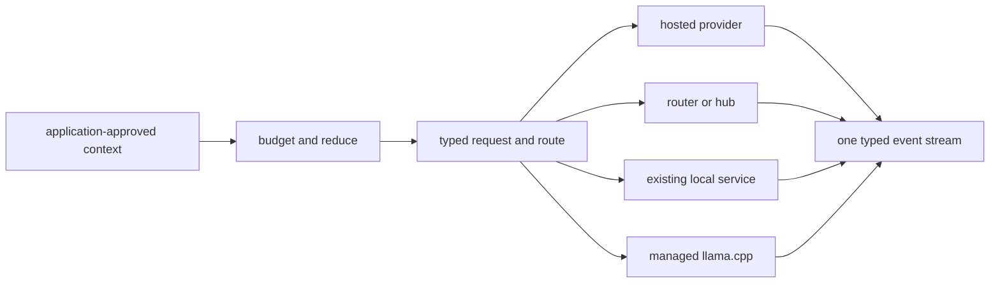

# When to use AnyInfer

AnyInfer is not the only way to call more than one model, and provider count is not a
reason to add another dependency. Use it when the application needs to own a hybrid
inference *runtime*, not merely switch API URLs.

## The problem it is built for

AnyInfer keeps four decisions inside one boundary:

1. **Prepare context** against the chosen target's provenance-tagged window and pricing.
2. **Select and route** across hosted providers, hubs, existing local services, and a
   managed local model.
3. **Enforce behavior** through typed events, structured-output validation, bounded repair,
   normalized usage, and explicit degradation signals.
4. **Own local lifecycle when asked** by acquiring verified model artifacts, selecting a
   runtime for the machine, tuning and supervising `llama-server`, and binding it to
   loopback.

That combination is useful for a desktop application, developer tool, offline-capable
service, or distributable Python product that wants a cloud route and a local route without
making each frontend implement the seam between them.

## Choose the smaller tool when it is enough

| Your actual requirement | Usually the better boundary |
|---|---|
| Call one provider | That provider's client or HTTP API |
| Switch among cloud APIs with one Python function | A focused provider client such as [any-llm](https://github.com/mozilla-ai/any-llm) or [aisuite](https://github.com/andrewyng/aisuite) |
| Centralize credentials, virtual keys, quotas, organization spend, and admin policy | A gateway such as [LiteLLM](https://github.com/BerriAI/litellm), [Bifrost](https://github.com/maximhq/bifrost), or [Portkey](https://github.com/Portkey-AI/gateway) |
| Operate a dedicated local-model platform | [Ollama](https://github.com/ollama/ollama), [LM Studio](https://lmstudio.ai/), or [LocalAI](https://github.com/mudler/LocalAI) |
| Run high-throughput GPU serving infrastructure | [vLLM](https://github.com/vllm-project/vllm) or another serving platform |
| Build semantic retrieval over a changing corpus | A retrieval or vector-index system; pass its approved results into AnyInfer if you still need the hybrid runtime |
| Ship one application-owned route spanning cloud and a managed local fallback | AnyInfer |

Those tools can be composed. AnyInfer earns its place only when removing the boundary
between them makes the application simpler or its behavior more reliable.

## What is actually distinctive

### Application-owned local inference

The managed `llama.cpp` path needs no separately operated local-model daemon. Runtime
installation is an explicit download, model artifacts are pinned and verified, and the
client owns tuning, readiness, active streams, idle eviction, and process cleanup. Existing
Ollama, LM Studio, and vLLM services remain valid targets when they are already the right
boundary.

### Portable behavior, not only portable syntax

An OpenAI-shaped request does not make providers behave alike. AnyInfer normalizes a typed
event stream, validates structured output on the client, records attempt history and timing,
tracks capability provenance, and announces dropped parameters or weaker enforcement
mechanisms. The [conformance matrix](../reference/conformance-matrix.md) states what is
actually supported.

### Context engineering with receipts

`client.budget()` connects the selected model's window, output reserve, safety headroom,
token estimate, and price into one preflight result. `anyinfer.context` can then select,
pack, or structurally reduce application-approved documents to the remaining allowance.
Every reduction reports its omissions and binding constraints; material that cannot fit at
any fidelity can be distilled hierarchically with call count and usage exposed.

Token counting and text splitting exist elsewhere. The useful distinction here is that the
same target capabilities drive budgeting, reduction, pre-dispatch refusal, cost planning,
and context-overflow routing.

## What is not a differentiator

- A long provider list.
- An OpenAI-compatible sidecar.
- Basic retry and fallback.
- The ability to call an already-running Ollama or vLLM endpoint.

AnyInfer supports all of those because integrators need them. Its reason to exist is the
coherent runtime and correctness contract around them.

## Continue

- [Why AnyInfer](../why-anyinfer.md) — the standout capabilities, with a dated comparison
  by category and the commands that check each claim
- [Choose an integration path](integration-paths.md)
- [Run a local model end to end](local-inference.md)
- [Token estimation and context budgets](../concepts/budgeting.md)
- [Fit a corpus to a context budget](fitting-context.md)
