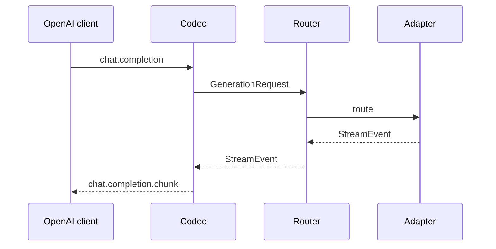
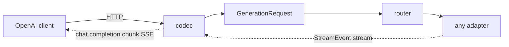

# OpenAI-compatible sidecar

An OpenAI-compatible projection of the same configured hybrid runtime used by the Python
SDK and command-line tool. It lets existing clients use your hosted, hub, and local routes
without creating a second routing or configuration system.

<div class="anyinfer-hero-diagram" markdown>

</div>

=== "Python installation"

    ```bash
    pip install "anyinfer[serve]"
    anyinfer serve --config anyinfer.json
    ```

=== "Standalone bundle"

    Download the bundle for your platform from [Downloads](../downloads.md), unzip it,
    then run:

    ```bash
    anyinfer-serve --config anyinfer.json
    ```

    The standalone build includes the frontend and built-in dependency-free adapters. Use
    the Python installation when a provider requires an optional SDK or authentication
    extra, such as GitHub Copilot or Azure Entra authentication.

```python
from openai import OpenAI

client = OpenAI(base_url="http://127.0.0.1:8080/v1", api_key="unused")

client.chat.completions.create(
    model="ollama:qwen3:8b",                    # or "medium", or "anthropic:..."
    messages=[{"role": "user", "content": "hi"}],
)
```

## Why this is cheap here

The internal primitive was never the OpenAI wire format — it is a normalized event stream.
Adapters already project provider dialects *into* that stream. The frontend is
simply the inverse projection at the edge:



No routing, validation, telemetry, credential, or local-inference code is duplicated. The
frontend is a wire codec plus an ASGI app around a normal `AsyncClient` — and an
architecture test enforces that it stays one.

## What it serves

| Endpoint | Behavior |
|---|---|
| `POST /v1/chat/completions` | Streaming and non-streaming. `model` is parsed as a target. |
| `GET /v1/models` | Catalog aliases plus any explicitly exposed targets. |
| `GET /health` | Liveness. Requires no authentication. |
| Anything else under `/v1` | 404 with a clear explanation. |

Embeddings, images, and audio are out of scope — AnyInfer models text generation only, and
says so rather than half-implementing them.

## Model strings are targets

Every target spelling works in the `model` field, which is what makes federation free:

```json
{"model": "medium"}
{"model": "anthropic:claude-sonnet-4-5"}
{"model": "ollama:qwen3:8b"}
{"model": "llama-cpp:qwen2.5-7b-instruct-q4-k-m"}
```

A round-trip test enforces that no target spelling can carry structure an OpenAI `model`
field cannot.

## What survives the wire, and what does not

**Survives:** messages, tools, `tool_choice`, `response_format.json_schema`, temperature,
top-p, max tokens, stop sequences, the stream flag, usage, and finish reasons. Unrecognized
extra-body fields reach `provider_options`, so the escape hatch survives too.

**Does not:** timing marks and attempt records. They have no `chat.completion.chunk`
representation, so AnyInfer-native observability is SDK-only. Everything the OpenAI format
*can* express, it does.

## Security

- Binds `127.0.0.1` by default.
- A non-loopback bind requires **both** `--allow-remote-exposure` and a bearer token. An
  unauthenticated LLM gateway on a network is a credential laundering service.
- Backend credentials never transit: the frontend authenticates *clients to itself*.
- Standard redaction applies to logs; payload retention is off by default.
- There are no configuration-execution endpoints of any kind — a deliberate response to how
  comparable gateways have been compromised.

=== "Bash"

    ```bash
    export ANYINFER_SERVE_TOKEN=$(openssl rand -hex 32)
    anyinfer serve --host 0.0.0.0 --allow-remote-exposure
    ```

=== "PowerShell"

    ```powershell
    $env:ANYINFER_SERVE_TOKEN = -join ((48..57)+(97..102)|Get-Random -Count 64|%{[char]$_})
    anyinfer serve --host 0.0.0.0 --allow-remote-exposure
    ```

## Embedding it

`create_app` returns a plain ASGI app, mountable in an existing Starlette or FastAPI stack:

```python
from anyinfer.serve import create_app

app = create_app(async_client, auth_token=token,
                 expose_targets=("anthropic:claude-sonnet-4-5",))
```

## Behind a proxy

The app sets `X-Accel-Buffering: no` on streaming responses. Without it, reverse proxies
buffer the whole response and streaming silently stops being streaming — a failure that only
appears in deployment, never in local testing.

## Configuration

The sidecar, CLI, and Python SDK use the same
[shared configuration file](../reference/configuration.md).

## See also

<div class="anyinfer-see-also" markdown>

- [Choosing an integration path](../guides/integration-paths.md)
- [Run a prompt from the shell](../guides/cli.md) — the same config file, one prompt, no server
- [Shared configuration](../reference/configuration.md)

</div>
