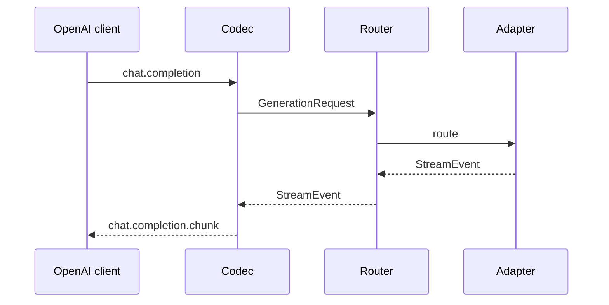

# OpenAI-Compatible Sidecar

An OpenAI-compatible projection of the same configured hybrid runtime used by the Python
SDK and command-line tool. It allows existing clients to use hosted, hub, and local routes
without creating a second routing or configuration system.

<div class="anyinfer-hero-diagram" markdown>

</div>

=== "Python installation"

    ```bash
    pip install "anyinfer[serve]"
    anyinfer serve --config anyinfer.json
    ```

=== "Standalone bundle"

    Download the platform's bundle from [Downloads](../downloads.md), unzip it,
    then run:

    ```bash
    anyinfer-serve --config anyinfer.json
    ```

    The standalone build includes the frontend and built-in dependency-free adapters. Use
    the Python installation when a provider requires an optional SDK or authentication
    extra, such as GitHub Copilot or Azure Entra authentication.

```python
from openai import OpenAI

client = OpenAI(base_url="http://127.0.0.1:8080/v1", api_key="unused")

client.chat.completions.create(
    model="ollama:qwen3:8b",  # or "medium", or "anthropic:..."
    messages=[{"role": "user", "content": "hi"}],
)
```

Since the internal primitive is a normalized event stream that adapters already project
provider dialects into, the frontend is only the inverse projection at the edge: a wire
codec plus an ASGI app around a normal `AsyncClient`. No routing, validation, telemetry,
credential, or local-inference code is duplicated, and an architecture test enforces that
the frontend stays a codec.

## What It Serves

| Endpoint | Behavior |
|---|---|
| `POST /v1/chat/completions` | Streaming and non-streaming. `model` is parsed as a target. |
| `GET /v1/models` | Catalog aliases plus any explicitly exposed targets. |
| `GET /health` | Liveness. Requires no authentication. |
| Anything else under `/v1` | 404 with a clear explanation. |

Embeddings and generated image/audio outputs are out of scope. Typed image, document, and
audio *inputs* are accepted in OpenAI content arrays and capability-gated before dispatch;
see [multimodal inputs](../concepts/multimodal-inputs.md).

## Model Strings Are Targets

Every target spelling works in the `model` field, which is what makes federation free:

```json
{"model": "medium"}
{"model": "anthropic:claude-sonnet-4-5"}
{"model": "ollama:qwen3:8b"}
{"model": "llama-cpp:qwen2.5-7b-instruct-q4-k-m"}
```

A round-trip test enforces that no target spelling can carry structure an OpenAI `model`
field cannot.

## What Survives the Wire, and What Does Not

**Survives:** text and multimodal message parts, tools, `tool_choice`,
`response_format.json_schema`, temperature, top-p, max tokens, stop sequences, the stream
flag, usage, and finish reasons. Unrecognized extra-body fields reach `provider_options`,
so the escape hatch survives too.

**Does not in the stock shape:** timing marks and attempt records. They have no
`chat.completion.chunk` representation. An AnyInfer-aware caller can request the complete
run manifest without changing what a stock OpenAI client receives:

```json
{
  "model": "medium",
  "messages": [{"role": "user", "content": "hi"}],
  "anyinfer_manifest": true
}
```

For a buffered response, `anyinfer_manifest` is a top-level response property. For a stream,
it is one terminal SSE frame immediately before `[DONE]`. Absence of the request field means
absence of both response forms. See [run manifests](../concepts/run-manifests.md).

## Security

- Binds `127.0.0.1` by default.
- A non-loopback bind requires **both** `--allow-remote-exposure` and a bearer token. An
  unauthenticated LLM gateway on a network is a credential laundering service.
- Backend credentials never transit: the frontend authenticates *clients to itself*.
- Standard redaction applies to logs; payload retention is off by default.
- There are no configuration or execution endpoints of any kind, so a captured token can
  spend inference, but it cannot rewrite routing or run code.

=== "Bash"

    ```bash
    export ANYINFER_SERVE_TOKEN=$(openssl rand -hex 32)
    anyinfer serve --host 0.0.0.0 --allow-remote-exposure
    ```

=== "PowerShell"

    ```powershell
    $env:ANYINFER_SERVE_TOKEN = -join ((48..57)+(97..102)|Get-Random -Count 64|%{[char]$_})
    anyinfer serve --host 0.0.0.0 --allow-remote-exposure
    ```

## Keeping It Running

`anyinfer serve install` writes the systemd unit, launchd agent, or scheduled task
that keeps the sidecar up across logins and reboots, after first showing the exact
file and commands. See [running as a service](running-as-a-service.md).

## Embedding It

`create_app` returns a plain ASGI app, mountable in an existing Starlette or FastAPI stack:

```python
from anyinfer.serve import create_app

app = create_app(async_client, auth_token=token, expose_targets=("anthropic:claude-sonnet-4-5",))
```

## Behind a Proxy

The app sets `X-Accel-Buffering: no` on streaming responses. Without it, reverse proxies
buffer the whole response and streaming silently stops being streaming (a failure that only
appears in deployment, never in local testing).

## Oversized Conversations

The sidecar applies whatever context policy its client was built with, since it is a codec
over a normal client rather than a second core. Give the shared config a
[`history` block](../reference/configuration.md#the-history-block) and a conversation that
outgrows its target's window is compacted instead of refused, with the same rules and the
same `ContextReduced` telemetry an SDK caller gets;
[context reduction](../concepts/context-reduction.md) covers the rules themselves.

A caller with a different tolerance can say so per request. The request body is a documented
superset of OpenAI chat completions, and this is what that superset is for:

```json
{
  "model": "openai:gpt-4o",
  "messages": [...],
  "anyinfer_history": {"mode": "proactive", "keep_recent": 2}
}
```

`false` refuses compaction for that request and returns the overflow error instead of a
shortened conversation; `true` accepts the defaults. A malformed value is a `400` rather
than a silent fallback to the gateway's setting.

## Reducing an Explicit Corpus

An application can also send an explicit, caller-approved corpus with a request:

```json
{
  "model": "openai:gpt-5-mini",
  "messages": [{"role": "user", "content": "Where is token refresh handled?"}],
  "anyinfer_context": {
    "documents": [
      {"path": "src/auth.py", "content": "...", "pinned": true},
      {"path": "src/session.py", "content": "..."}
    ],
    "query": "token refresh",
    "strategy": "ranked",
    "max_tokens": 6000,
    "placement": "system"
  }
}
```

`anyinfer_context` is stateless: every request carries the documents, the sidecar stores
none of them and never collects files, and reduction is delegated to the normal core
client. Default ceilings hold the envelope to 1,000 documents and 5 MiB. The
inference-spending `distill` strategy is refused here, and a request needs either a
trusted target context window or an explicit `max_tokens` budget, so the reducer always
has a real ceiling to fit against. The response reports selected and omitted counts
without echoing paths or content; a stream carries the same summary in its terminal
extension frame. Since uploading material the server then omits wastes bandwidth, a large
local corpus is better served by `anyinfer context` or `anyinfer run --context-dir`
running beside the files. [Context reduction](../concepts/context-reduction.md) explains
the strategies; [fit a corpus to a context budget](../guides/fitting-context.md) covers
choosing one.

## Fixed-Target Arena Requests

An AnyInfer-aware caller can add `anyinfer_arena` with the complete `ArenaPolicy` field set,
or use a configured arena name as `model`. The response stays a valid single-choice OpenAI
completion with candidate evidence added under the same extension name; streams buffer the
branches and emit only the winner, so candidate events never interleave. Strategies, spend
reservation, and tool-loop behavior are covered in [arena runs](../concepts/arena.md).

## Configuration

The sidecar, CLI, and Python SDK use the same
[shared configuration file](../reference/configuration.md).

!!! tip "Key Takeaways"
    - The sidecar is a wire codec over the same client the SDK uses; routing, credentials,
      telemetry, and context policy come from the shared configuration, not a second
      system.
    - Any target spelling works as the `model` field, so hosted, hub, and local routes are
      all reachable from a stock OpenAI client.
    - The AnyInfer extensions (`anyinfer_manifest`, `anyinfer_history`, `anyinfer_context`,
      `anyinfer_arena`) are additive: a client that does not send them receives a plain
      OpenAI completion.
    - A non-loopback bind requires both `--allow-remote-exposure` and a bearer token, and
      backend credentials never transit the frontend.

## See Also

<div class="anyinfer-see-also" markdown>

- [Integrate AnyInfer](../guides/README.md)
- [Run a prompt from the shell](../guides/cli.md): the same config file, one prompt, no server
- [Shared configuration](../reference/configuration.md)
- [Running as a service](running-as-a-service.md): surviving a reboot

</div>
